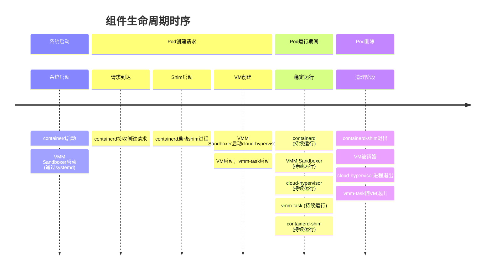
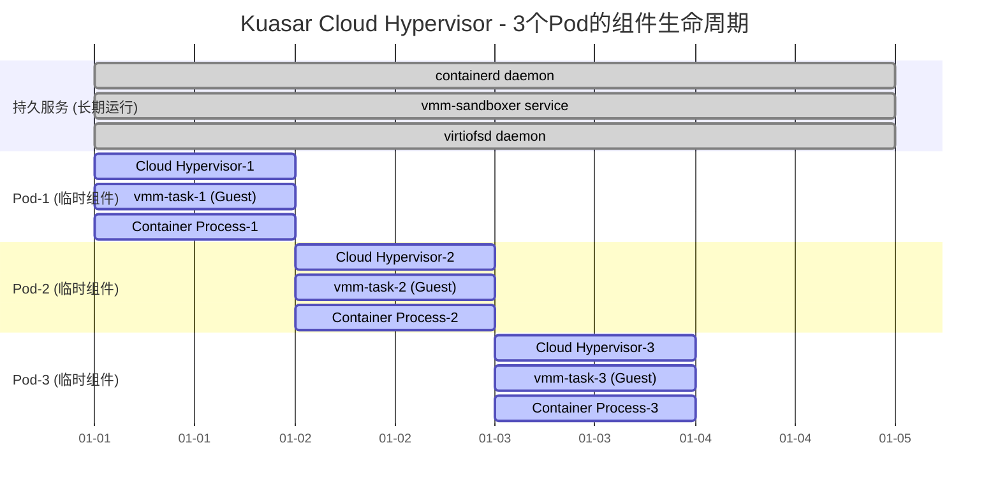
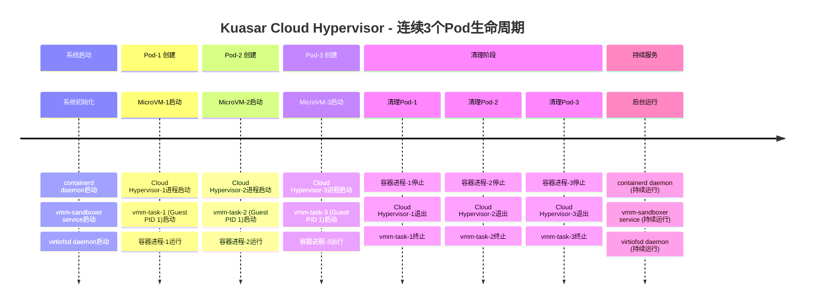
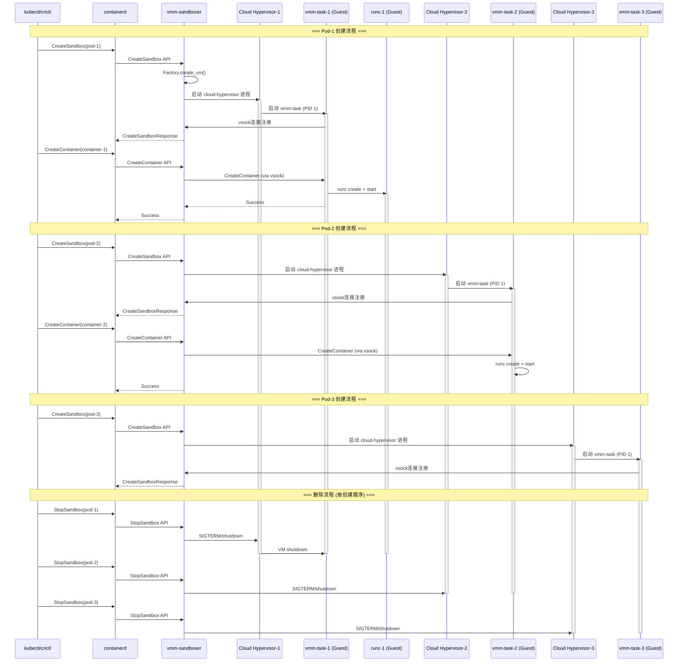
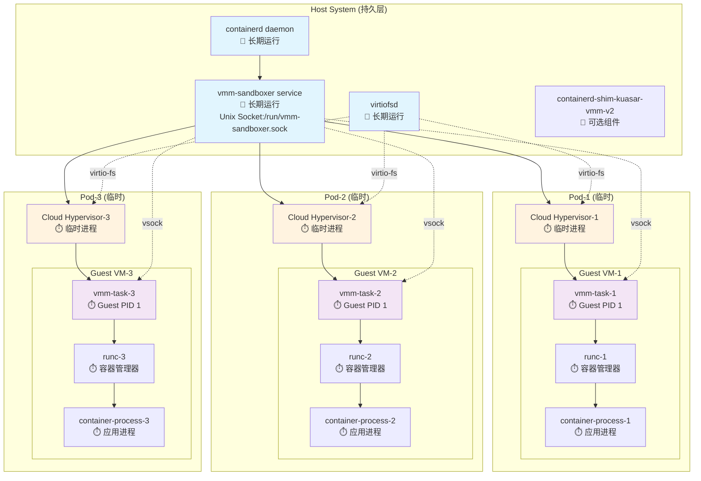
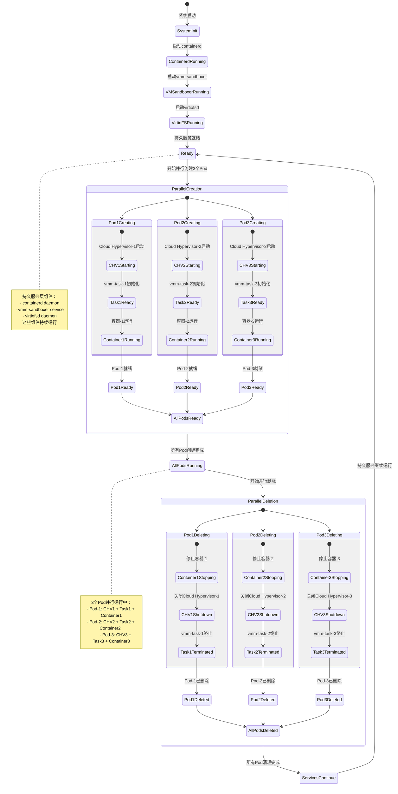
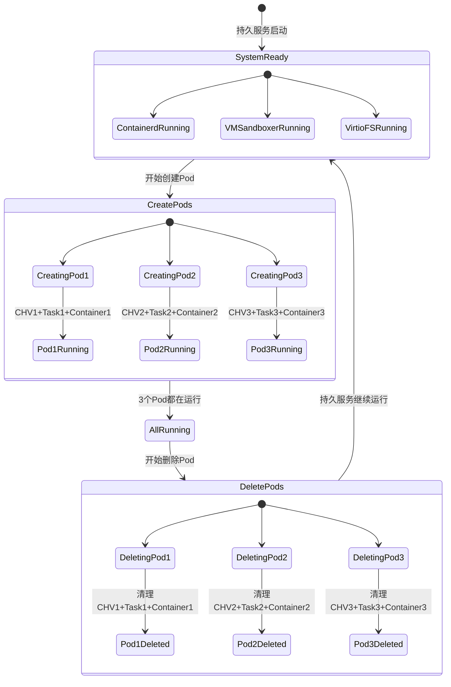
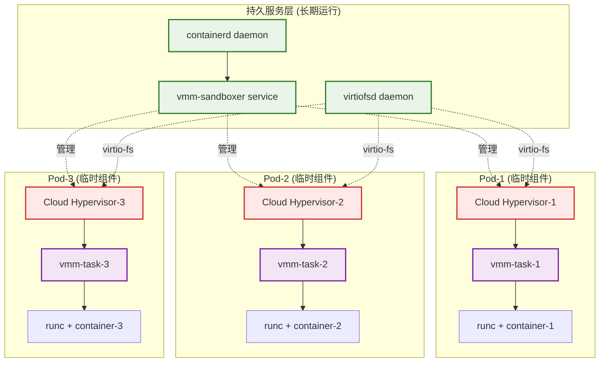

仅考虑创建 cloud hypervisor microvm 的场景。

## 组件生命周期分析

长时间运行的服务组件（守护进程）

1. **containerd**

    - **类型**: 外部长期运行的系统服务
    - **生命周期**: 系统级守护进程，通过systemd管理
    - **功能**: 容器运行时管理，接收CRI调用

2. **VMM Sandboxer** (`cloud_hypervisor`)

    - **类型**: Kuasar提供的长期运行服务
    - **生命周期**: 通过systemd服务启动并持续运行
    - **服务文件**: `vmm/service/kuasar-vmm.service`
    - 功能:
       - 监听Unix Socket等待沙箱创建请求
       - 管理多个虚拟机实例的生命周期
       - 与containerd shim通信

3. **cloud-hypervisor进程**

    - **类型**: 外部hypervisor守护进程
    - **生命周期**: 每个VM对应一个进程，VM存在期间持续运行
    - **功能**: 实际的虚拟机监控和硬件模拟

4. **vmm-task** (VM内部)

    - **类型**: VM内部的任务服务器
    - **生命周期**: 随VM启动而启动，VM存在期间持续运行
    - **功能**: 在VM内部处理容器操作请求

短时间运行的临时组件

1. **containerd-shim-kuasar-vmm-v2**

    - **类型**:  临时进程
    - 生命周期 :
      - 由containerd为每个Pod启动
      - Pod删除时退出
    - **功能**: 作为containerd和VMM sandboxer之间的桥梁

## Cloud Hypervisor 场景

以连续创建并删除3个Cloud Hypervisor microVM为例，各个组件的参与流程和生命周期：

长时间运行，服务于全部 3 次创建和删除的组件是：

- containerd daemon
- vmm-sandboxer service
- virtiofsd daemon

### 时间线视图

### 详细交互流程图

### 架构组件图:

### 进程生命周期状态图

简化版本：

### 资源管理视图

