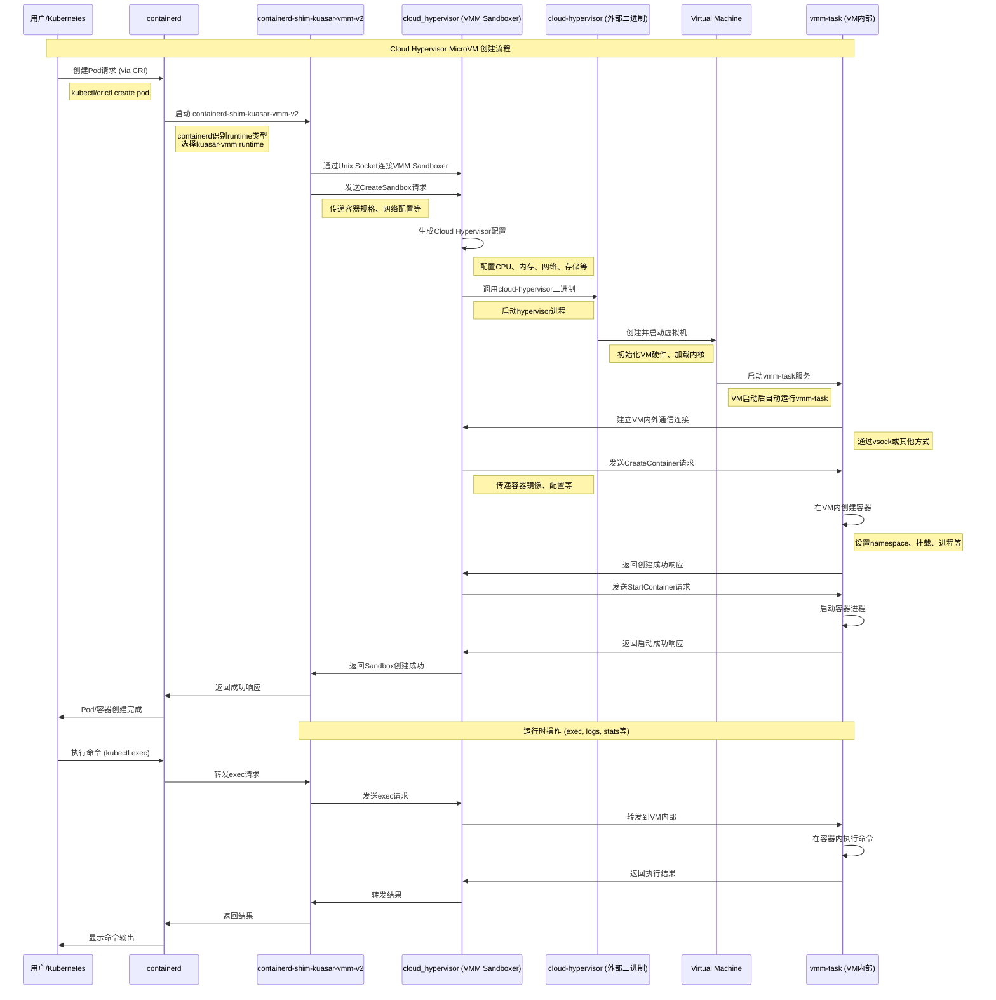

## 所有组件

### 代码分析

kuasar 代码仓库中共有如下 11 个 Cargo.toml：

1. Cargo.toml

2. shim/Cargo.toml

3. vmm/task/Cargo.toml

4. runc/Cargo.toml

5. quark/Cargo.toml

6. wasm/Cargo.toml

7. vmm/sandbox/src/bin

8. vmm/sandbox/src/bin/qemu/main.rs

9. runc/src/main.rs

10. quark/src/main.rs

11. wasm/src/main.rs

通过对上述所有 Cargo.toml 文件的分析，kuasar项目总共会打包出以下二进制文件。

### 二进制文件总览

kuasar项目总共会打包出**8个主要的二进制文件**，分为以下几类：

#### 1. Shim 二进制文件 (2个)

- **containerd-shim-kuasar-vmm-v2**
  - 功能：VMM sandboxer的containerd shim
  - main入口：`shim/src/bin/containerd-shim-kuasar-vmm-v2.rs`
- **containerd-shim-kuasar-wasm-v2**
  - 功能：WASM sandboxer的containerd shim
  - main入口：`shim/src/bin/containerd-shim-kuasar-wasm-v2.rs`

#### 2. Sandboxer 二进制文件 (4个)

- **quark-sandboxer**
  - 功能：App-Kernel沙箱运行时
  - main入口：`quark/src/main.rs`
- **runc-sandboxer**
  - 功能：传统runc沙箱运行时的包装器
  - main入口：`runc/src/main.rs`
- **wasm-sandboxer**
  - 功能：WebAssembly沙箱运行时(支持WasmEdge和Wasmtime)
  - main入口：`wasm/src/main.rs`
- **vmm-task**
  - 功能：VMM任务服务器(在虚拟机内部运行)
  - main入口：`vmm/task/src/main.rs`

#### 3. VMM Hypervisor 二进制文件 (3个)

这些都在`vmm/sandbox`模块中定义：

- **qemu**
  - 功能：基于QEMU的虚拟机监控器
  - main入口：`vmm/sandbox/src/bin/qemu/main.rs`
- **cloud_hypervisor**
  - 功能：基于Cloud Hypervisor的虚拟机监控器
  - main入口：`vmm/sandbox/src/bin/cloud_hypervisor/main.rs`
- **stratovirt**
  - 功能：基于StratoVirt的虚拟机监控器
  - main入口：`vmm/sandbox/src/bin/stratovirt/main.rs`

#### 4. 测试工具 (1个)

- kuasar-e2e
  - 功能：端到端测试工具
  - main入口：`tests/e2e/src/main.rs`

关于Cargo.toml的说明

并不是所有的Cargo.toml都会打包出二进制文件：

- **vmm/common/Cargo.toml**: 这是一个库(library)模块，不生成二进制文件，只提供给其他模块使用的共享代码
- **vmm/sandbox/derive/Cargo.toml**: 这是一个过程宏库，不生成独立的二进制文件

所以总结来说，kuasar项目会生成8个主要的可执行二进制文件，覆盖了从容器运行时到虚拟机监控器的完整技术栈。

## cloud hypervisor 相关

### 相关的二进制文件

如果只考虑启动Cloud Hypervisor的microVM，需要使用到的二进制文件包括：

必需的Kuasar二进制文件

1. Shim二进制文件 containerd-shim-kuasar-vmm-v2

    - 功能：作为containerd和VMM sandboxer之间的桥梁
    - 位置：`shim/src/bin/containerd-shim-kuasar-vmm-v2.rs`
    - 作用：接收containerd的CRI调用，转发给VMM sandboxer

2. VMM Sandboxer二进制文件 cloud_hypervisor (VMM sandboxer的一个实现)

    - 功能：基于Cloud Hypervisor的虚拟机监控器和沙箱管理器
    - 位置：`vmm/sandbox/src/bin/cloud_hypervisor/main.rs`
    - 作用：创建和管理Cloud Hypervisor虚拟机实例，处理容器生命周期

3. 虚拟机内部任务服务器 vmm-task

    - 功能：在虚拟机内部运行的任务服务器
    - 位置：`vmm/task/src/main.rs`
    - 作用：在VM内部处理容器的创建、启动、停止等操作

外部依赖的二进制文件

4. Cloud Hypervisor本体

    - 这是外部的Cloud Hypervisor项目提供的二进制文件
    - Kuasar通过调用这个二进制文件来实际启动和管理虚拟机

总结: 最核心的是这4个二进制文件：

1. `containerd-shim-kuasar-vmm-v2` (Kuasar提供)
2. `cloud_hypervisor` VMM sandboxer (Kuasar提供)
3. `vmm-task` (Kuasar提供)
4. `cloud-hypervisor` (外部Cloud Hypervisor项目提供)

这是启动Cloud Hypervisor microVM的最小二进制文件集合。其他的sandboxer(如wasm、quark、runc)以及对应的shim在这个场景下都不需要。

### 典型的工作流程

1. **containerd** 接收到创建Pod/容器的请求
2. **containerd-shim-kuasar-vmm-v2** 被containerd调用
3. **cloud_hypervisor** (VMM sandboxer) 被shim启动
4. VMM sandboxer调用外部的 **cloud-hypervisor** 二进制文件创建虚拟机
5. **vmm-task** 在虚拟机内部启动，处理容器相关操作

这个序列图展示了以下关键步骤：

主要阶段

1. **请求发起**: 用户通过kubectl/crictl发起Pod创建请求
2. **Shim启动**: containerd根据RuntimeClass选择并启动kuasar shim
3. **Sandbox创建**: Shim与VMM Sandboxer通信，请求创建新的沙箱
4. **VM创建**: VMM Sandboxer调用Cloud Hypervisor创建虚拟机
5. **VM初始化**: 虚拟机启动，内部的vmm-task服务开始运行
6. **容器管理**: 通过VM内外通信在虚拟机内创建和启动容器
7. **运行时操作**: 支持exec、logs等运行时操作

关键组件职责

- **containerd-shim-kuasar-vmm-v2**: CRI到Kuasar的适配层
- **cloud_hypervisor (VMM Sandboxer)**: 虚拟机生命周期管理
- **cloud-hypervisor**: 实际的hypervisor进程
- **vmm-task**: VM内部的容器管理服务

这个架构实现了容器在轻量级虚拟机中的强隔离运行。

