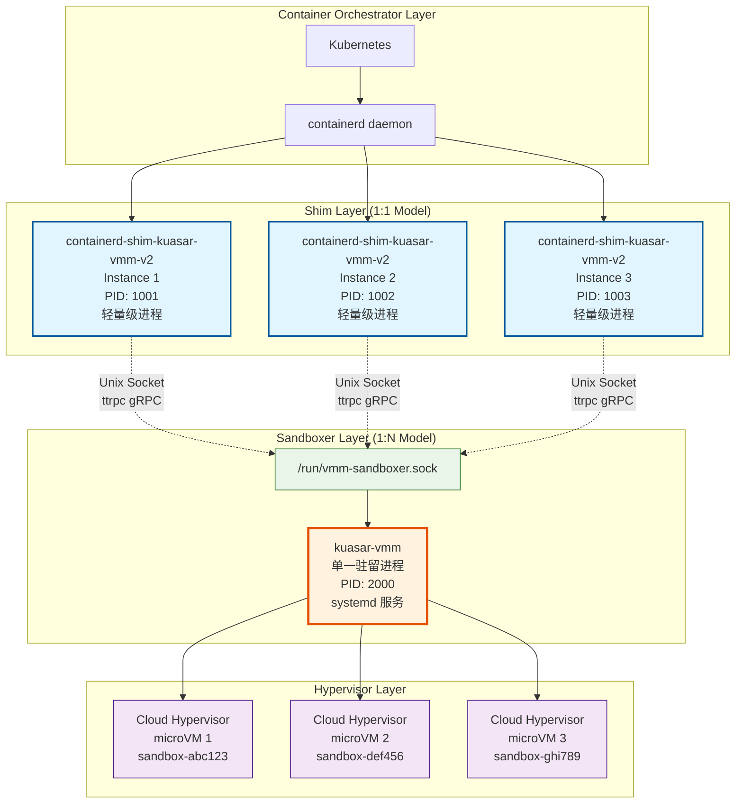
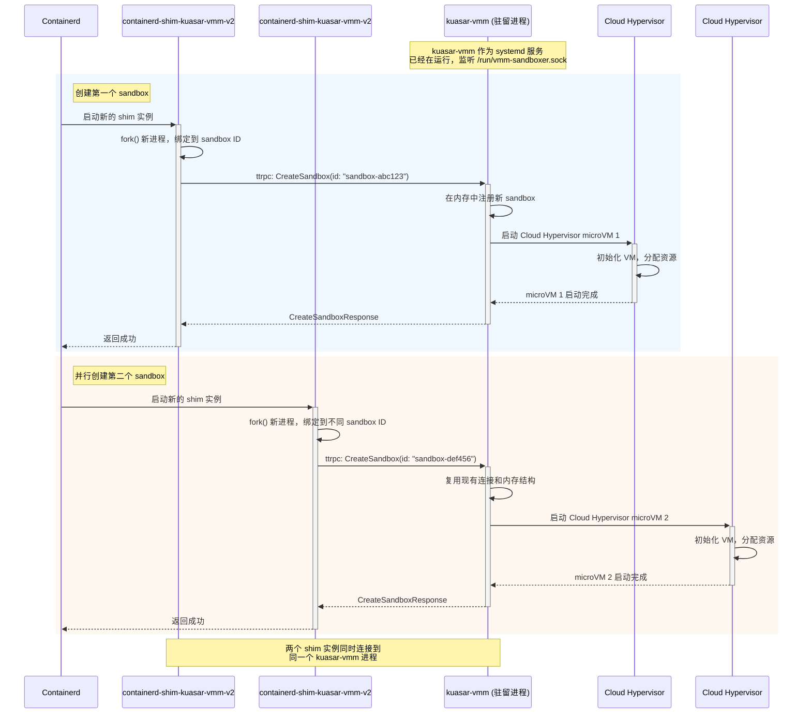
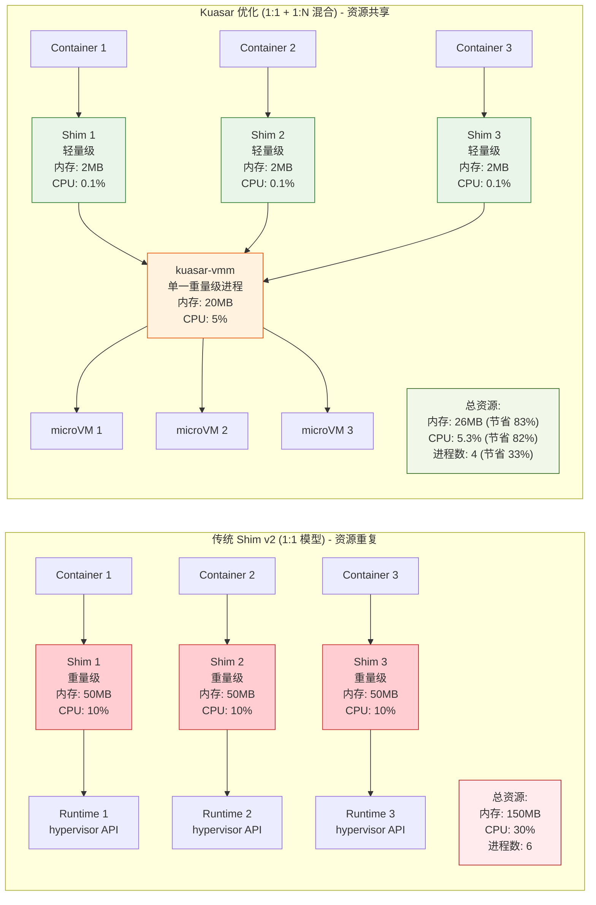
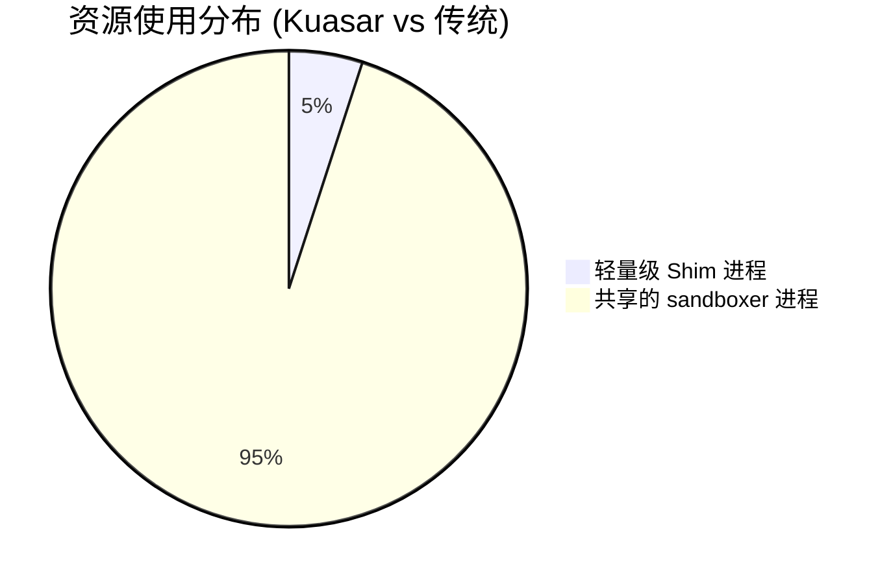
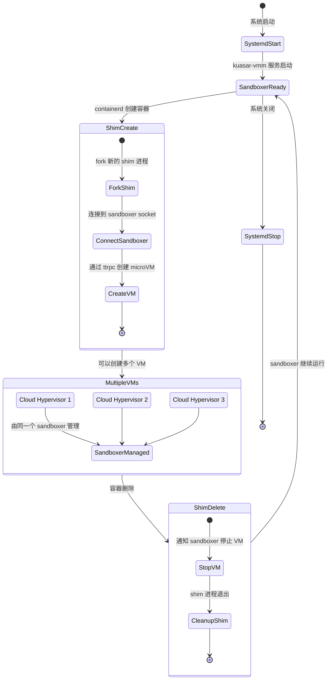

背景：发现 greptile 在回答时说 shim 是 1：1 模型，但看 kuasar 的介绍又说 kuasar 特意对 shim 进行了优化，采用 1：N 模型。所以深挖了一下。

问： containerd-shim-kuasar-vmm-v2 这个组件，在连续创建 cloud hypervisor 的 microvm 时，是会为每个 micorovm 的创建而启动一个 containerd-shim-kuasar-vmm-v2 实例，还是一直重用一个 containerd-shim-kuasar-vmm-v2 实例？

再问：关于这一点，我看到 kuasar 的介绍中提到：

优化框架：通过移除所有暂停容器并将 shim 进程替换为单个驻留沙盒器进程，Kuasar 进行了优化，带来了 1:N 进程管理模型，其性能优于当前的 1:1 shim v2 进程模型。基准测试结果显示，Kuasar 的沙盒启动速度提升 2 倍，而管理资源开销降低了 99%。更多详情请参考性能。

greptile的回答：

**containerd-shim-kuasar-vmm-v2 确实会为每个 microVM 的创建而启动一个新的实例，但所有实例都连接到同一个长期运行的 sandboxer 进程。** 这是 Kuasar 实现性能优化的关键架构设计。

## Kuasar 的双层架构设计原理

Kuasar 采用了一种巧妙的**双层架构**，既保持了与 containerd shim v2 API 的完全兼容性，又实现了显著的性能优化：

第一层：Shim 层（1:1 模型）

- **每个 sandbox 仍然有一个独立的 containerd-shim-kuasar-vmm-v2 实例**
- 这些 shim 进程变得极其轻量，主要负责：
  - 接收 containerd 的 API 调用
  - 转发请求给 sandboxer 进程
  - 处理 I/O 管道和信号

第二层：Sandboxer 层（1:N 模型）

- 单一的长期运行的 sandboxer 进程（如 `kuasar-vmm`）
- 管理多个 Cloud Hypervisor microVM 实例
- 处理所有重量级操作

### 整体架构图



### 进程创建和通信时序图



### 资源优化对比图



## 代码实现细节

### Shim 层的轻量化实现

从 `shim/src/service.rs` 可以看到，每个 shim 实例的核心职责：

```rust
// 每个 shim 实例都有独立的 ID 和数据结构
2impl<Transport> Shim for Service<Transport> {
3    async fn new(_runtime_id: &str, id: &str, _namespace: &str, _config: &mut Config) -> Self {
4        let exit = Arc::new(ExitSignal::default());
5        Self {
6            kuasar_server: Box::new(KuasarServer::new(id, exit).await),
7        }
8    }
9}
10
11// 但所有 shim 实例都连接到同一个 sandboxer 地址
12impl<T: ContainerIoTransport> KuasarServer<T> {
13    pub async fn new(id: &str, exit: Arc<ExitSignal>) -> Self {
14        let channel = Endpoint::from_static("https://www.kuasar.io")
15            .connect_with_connector(service_fn(
16                |_: Uri| UnixStream::connect(T::sandboxer_addr()), // 同一个 socket 地址！
17            ))
18            .await
19            .expect("sandboxer should be running");
20    }
21}
```

### Sandboxer 层的单实例架构

从 `vmm/sandbox/src/bin/qemu/main.rs` 可以看到，sandboxer 作为单一进程运行：

```rust
#[tokio::main]
2async fn main() {
3    // 创建单一的 sandboxer 实例
4    let mut sandboxer: KuasarSandboxer<QemuVMFactory, QemuHooks> = KuasarSandboxer::new(
5        config.sandbox,
6        config.hypervisor.clone(),
7        QemuHooks::new(config.hypervisor),
8    );
9    
10    // 在指定地址监听，为所有 shim 提供服务
11    containerd_sandbox::run(
12        "kuasar-vmm-sandboxer-qemu",
13        &args.listen,  // /run/vmm-sandboxer.sock
14        &args.dir,
15        sandboxer,     // 单一实例管理多个 sandbox
16    )
17    .await
18    .unwrap();
19}
```

## 性能优化的关键机制

优化效果饼图:



1. **消除重复开销**

   - 只有一个进程处理与 hypervisor 的交互

   - 共享内存池和连接池

   - 统一的 VM 生命周期管理

2. **保持完整兼容性**

   - containerd 仍然看到熟悉的 shim v2 接口

   - 每个 sandbox 保持独立的进程边界

   - 故障隔离和资源清理机制不变

3. **99% 资源节省的实现**

   - 大部分 shim 实例从重量级变为轻量级

   - 重量级的 VM 管理逻辑只有一份

   - 避免重复的 hypervisor API 连接

## 生命周期管理流程



