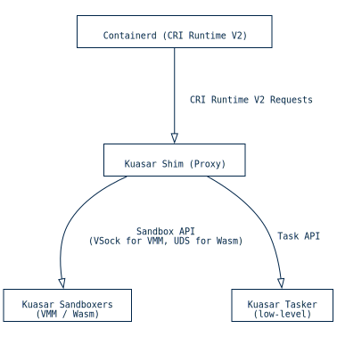
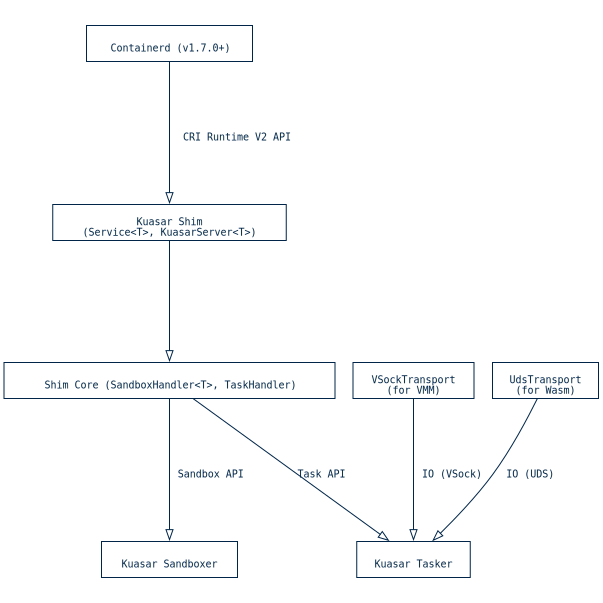
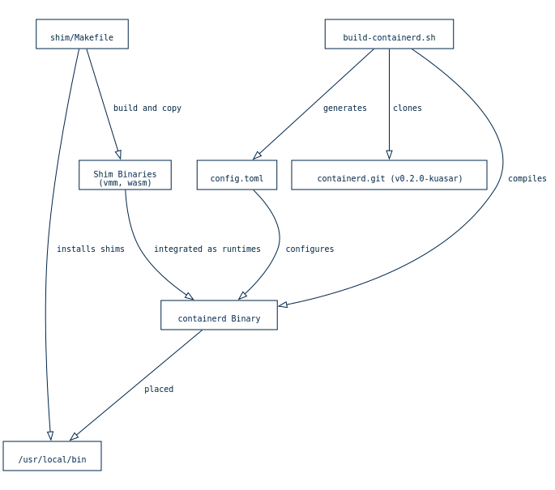
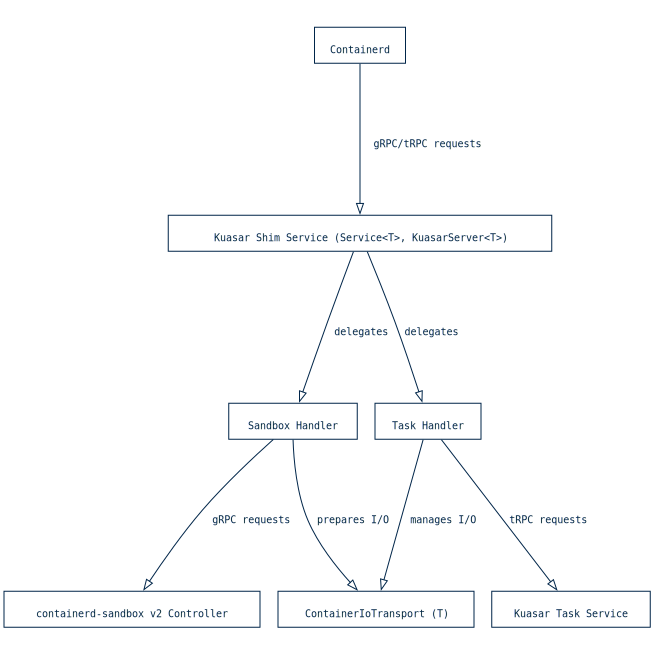

https://codewiki.google/github.com/kuasar-io/kuasar#container-runtime-integration

---




Kuasar 与容器运行时（特别是 `containerd` ）通过一个专门的 `shim proxy` 进行集成。这个代理充当一个 `CRI runtime V2 backend` ，在 `containerd` 和 Kuasar 的各种沙箱进程之间中继请求。这个 `shim` 的主要功能是将 `Sandbox API` 请求转发到相应的 Kuasar 沙箱进程（例如 VMM 或 Wasm 沙箱进程），并将 `Task API` 请求转发到低级任务器，从而将复杂的处理工作从代理本身卸载。

`shim` 组件是使 `containerd` 能够协调 Kuasar 的多样化沙盒的核心，包括 MicroVMs ( `kuasar-vmm` ) 和 WebAssembly 模块 ( `kuasar-wasm` )。针对这些不同环境有特定的 `shim` 二进制文件，例如用于 MicroVMs 的 `containerd-shim-kuasar-vmm-v2` 和用于 Wasm 工作负载的 `containerd-shim-kuasar-wasm-v2` 。这些适配器被构建并安装到系统中，通常在 `/usr/local/bin/` 中，使用位于 `shim/Makefile` 的 `Makefile` 进行构建和安装。

`containerd` 与 Kuasar 沙盒进程之间的交互依赖于进程间通信机制。对于 `kuasar-vmm` ，通信通常通过 VSock 进行，这适用于虚拟化环境。对于 `kuasar-wasm` ，通常使用 Unix 域套接字（UDS）进行高效通信。 `shim` 负责建立和管理这些通信通道。

要集成 Kuasar 与 `containerd` ，需要在 `containerd` 的配置文件中进行特定修改，该文件通常位于 `/etc/containerd/config.toml` 。这些修改定义了 `runtime_type` 和 `sandbox_mode` 设置，用于 `kuasar-vmm` 和 `kuasar-wasm` 运行时，指定 `containerd` 如何调用 Kuasar 的 shims。此外，必须使用 `ENABLE_CRI_SANDBOXES=1` 环境变量启动 `containerd` ，以启用 `containerd Sandbox API` ，这对 Kuasar 的运行至关重要。

提供有关构建、安装和配置 Kuasar `shim` 和 `containerd` 的全面指南，详细说明了先决条件和必要的系统调整。有关 shim 内部结构的更多详细信息，请参阅 Shim 代理架构和通信机制。

## 代理架构和通信机制



Kuasar `shim` 作为 `CRI runtime V2 backend` ，在 `containerd` 和 Kuasar 的 `sandboxer` 进程之间进行通信中介。这种架构允许 `containerd` 通过一致接口管理多样化的 Kuasar 沙盒，包括 MicroVM 和 WebAssembly (Wasm) 环境。Shim 主要作为代理，将 `Sandbox API` 请求转发到相应的 `sandboxer` （例如 `vmm-sandboxer` 或 `wasm-sandboxer` ），将 `Task API` 请求转发到低级的 `tasker` ，从而最小化 Shim 对这些请求的内部处理。

沙盒的核心功能通过 `Service<T>` 结构实现，该结构遵循 `Shim` 特性。这个 `Service` 包含一个 `KuasarServer<T>` ，封装了与 Kuasar 组件交互的业务逻辑。这个 `KuasarServer` 又包括一个用于沙盒操作的 `SandboxHandler<T>` 和一个用于管理任务的 `TaskHandler` 。

`containerd` 、 `shim` 以及 Kuasar 的 `sandboxer` 和 `tasker` 进程之间的进程间通信（IPC）通过不同的传输机制实现。对于 VMM 工作负载， `containerd-shim-kuasar-vmm-v2` 利用 `VSockTransport` ，实现通过虚拟套接字进行通信，这在虚拟化环境中很常见。这对于使用 MicroVMs 隔离容器的场景尤其相关。 `shim/src/io.rs` 中的 `VSockTransport` 管理虚拟套接字端口分配以防止冲突，并处理 `containerd` 管道和虚拟套接字流之间的数据传输。

对于 Wasm 工作负载， `containerd-shim-kuasar-wasm-v2` 采用 `UdsTransport` （Unix 域套接字）。这适用于 Wasm 沙盒可能不需要完整虚拟机的情况，可在主机系统内部提供高效的 IPC。 `shim/src/io.rs` 中的 `UdsTransport` 直接使用提供的管道路径， `containerd` 负责 UDS I/O 复制。

两个 shim 都建立与 Kuasar `sandboxer` 和 `tasker` 进程的连接。 `shim/src/sandbox.rs` 中的 `SandboxHandler` 负责将 `containerd-shim` TTRPC 请求转换为 `containerd-sandbox` v2 控制器的 gRPC 调用，管理从创建到关闭的沙盒的完整生命周期。 `shim/src/task.rs` 中的 `TaskHandler` 作为代理，将 `containerd` 垫片 `Task API` 调用转发到底层 `TaskClient` ，并与 `SandboxHandler` 协调容器和进程生命周期管理以及资源分配。这种架构确保了 `containerd` 可以无缝地与 Kuasar 的各种沙盒技术交互。有关 `containerd` 集成的更多详细信息，请参阅容器运行时集成。

## 构建与安装 Kuasar Shim



Kuasar `containerd` shim 通过位于 `shim/Makefile` 的 `Makefile` 进行构建和安装。这个 `Makefile` 协调编译和安装两个不同的 shim 二进制文件： `containerd-shim-kuasar-vmm-v2` 和 `containerd-shim-kuasar-wasm-v2` 。这些二进制文件使 `containerd` 能够分别与 Kuasar 的 VMM 和 Wasm 运行时集成。构建过程利用 `cargo build --release` 创建优化的可执行文件。构建完成后， `install` 目标将这些二进制文件移动到系统的 `/usr/local/bin/` 目录，确保它们对 `containerd` 可用。

与 shim 构建互补，Kuasar 项目还包含一个用于构建自定义 `containerd` 二进制文件的脚本。该脚本位于 `scripts/build/build-containerd.sh` ，克隆 `containerd` 仓库的 Kuasar 特定分支，进行编译，并生成 `config.toml` 文件。此配置文件对于集成 Kuasar 运行时至关重要，它定义了 `runtime_type` 的设置，用于 `kuasar-runc` 、 `kuasar-vmm` 、 `kuasar-quark` 和 `kuasar-wasm` ，并配置 `proxy_plugins` 以促进与各自的沙盒服务通信。这种自定义的 `containerd` 设置对于确保 shim 能够正确地与 Kuasar 的多沙盒功能交互至关重要。若要深入了解这些 shim 如何与 `containerd` 集成，请参阅 Kuasar 运行时的 Containerd 配置。

### shim 服务和沙盒/任务管理



Kuasar 中的 `containerd` shim 服务充当关键的中介，将来自 `containerd` 的请求转换为由 Kuasar 的沙盒器和任务服务管理的操作。该服务主要由 `Service<T>` 结构实现，该结构遵循 `containerd` 的 `Shim` 特性。 `Service<T>` 利用一个 `KuasarServer<T>` 实例来封装与 Kuasar 后端交互所需的应用逻辑。

`KuasarServer<T>` 的核心包含两个关键组件： `SandboxHandler<T>` 和 `TaskHandler` 。 `SandboxHandler<T>` 负责协调沙盒的生命周期。当 `containerd` 请求创建、启动、停止或删除沙盒等操作时， `SandboxHandler` 接收这些 TTRPC 请求，并将它们转换为对 `containerd-sandbox` v2 控制器的相应 gRPC 调用。这种委托确保实际的沙盒管理，包括资源分配和隔离，由 Kuasar 沙盒器处理。 `SandboxHandler` 还管理沙盒的本地文件系统设置和清理，例如创建根目录和挂载共享内存，具体细节请参见沙盒状态管理和持久化。

同样地，TaskHandler 负责管理沙箱内任务（容器和进程）的生命周期。它充当代理角色，将 containerd 适配层的任务 API 调用转发至底层的 TaskClient，后者再与 Kuasar Task Service 进行通信。当 containerd 请求创建、启动或删除容器或进程时，KuasarServer<T> 中的 TaskHandler 会拦截这些请求。例如在容器创建请求中，它首先通过 SandboxHandler 准备沙箱环境，接着使用 ContainerIoTransport 配置 I/O 流，最后将任务创建委托给 TaskClient。该架构确保所有容器和进程操作（包括 I/O 管理）均由 Kuasar 任务服务协调执行，并通过 gRPC 实现进程间通信。关于 containerd 如何配置以与这些 Kuasar 运行时交互的具体细节，详见《Kuasar 运行时的 containerd 配置指南》。

## Kuasar 运行时的 Containerd 配置


```tom
# /etc/containerd/config.toml

# ... other containerd configurations ...

[plugins."io.containerd.grpc.v1.cri"]
  # ... other CRI plugin configurations ...
  disable_apparmor = true # Important: AppArmor is not supported, must be true

  [plugins."io.containerd.grpc.v1.cri".containerd]
    # ... other containerd configurations within CRI plugin ...

    [plugins."io.containerd.grpc.v1.cri".containerd.runtimes.kuasar-vmm]
      runtime_type = "io.containerd.kuasar-vmm.v2"
      sandbox_mode = "shim"

    [plugins."io.containerd.grpc.v1.cri".containerd.runtimes.kuasar-wasm]
      runtime_type = "io.containerd.kuasar-wasm.v2"
      sandbox_mode = "shim"

# ... rest of the config.toml ...
```

将 Kuasar 与 [`containerd`](https://github.com/kuasar-io/kuasar/blob/a5dc8e2c564405a8c389aaaf3eb708a123059ce1/README.md?plain=1#L138) 集成需要对 [`containerd`](https://github.com/kuasar-io/kuasar/blob/a5dc8e2c564405a8c389aaaf3eb708a123059ce1/README.md?plain=1#L138) 配置文件进行特定修改，该文件通常位于 [`/etc/containerd/config.toml`](https://github.com/kuasar-io/kuasar/blob/a5dc8e2c564405a8c389aaaf3eb708a123059ce1/docs/containerd.md?plain=1#L20) 。这些修改定义了 [`containerd`](https://github.com/kuasar-io/kuasar/blob/a5dc8e2c564405a8c389aaaf3eb708a123059ce1/README.md?plain=1#L138) 如何与 Kuasar 的各种沙箱运行时进行交互。Kuasar shim 充当 [`CRI runtime V2 backend`](https://github.com/kuasar-io/kuasar/blob/a5dc8e2c564405a8c389aaaf3eb708a123059ce1/docs/shim/README.md?plain=1#L3) 负责协调这种通信，详情请参阅 [“容器运行时集成”部分 ](https://codewiki.google/github.com/kuasar-io/kuasar#container-runtime-integration)。

对于 kuasar-vmm （MicroVM）和 kuasar-wasm （WebAssembly）运行时，需要配置 containerd runtime_type 和 sandbox_mode 设置。对于 kuasar-vmm ，需要将 runtime_type 设置为 "io.containerd.kuasar-vmm.v2" ， sandbox_mode 设置为 "shim" 。类似地，对于 kuasar-wasm ， runtime_type 设置为 "io.containerd.kuasar-wasm.v2" ， sandbox_mode 也相同。此配置的示例可在 docs/shim/README.md 中找到。

除了这些运行时特定的设置之外， containerd 中的 AppArmor 功能不受 Kuasar 支持，因此需要配置项 disable_apparmor = true 。此外，要启用 containerd 的 Sandbox API ，必须使用环境变量 ENABLE_CRI_SANDBOXES=1 启动 containerd 。此环境变量对于 containerd 正确使用 sandbox_mode = "shim" 设置并将沙箱管理委托给 Kuasar 至关重要。

安装脚本（例如 scripts/install/build-and-install-kuasar-vmm.sh 和 scripts/install/install-kuasar-vmm-x86.sh ）会自动将系统中的 containerd 二进制文件替换为 Kuasar 兼容版本，并将 Kuasar 特有的 config.toml 文件复制到 /etc/containerd/config.toml ，其中包含必要的配置。另一方面， uninstall-kuasar-vmm.sh 脚本可以根据需要删除这些配置以及 Kuasar 特有的 containerd ，具体说明请参见 scripts/install/README.md 。
