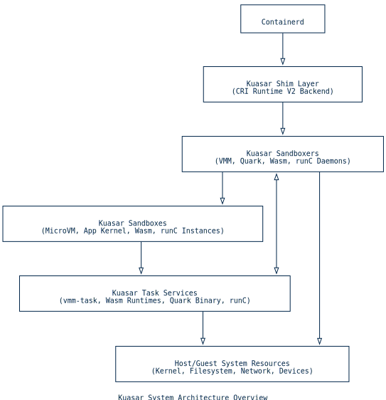
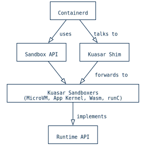
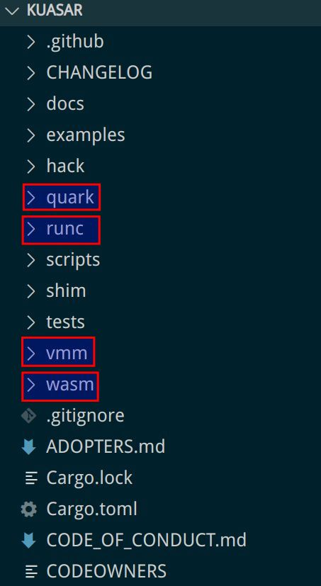
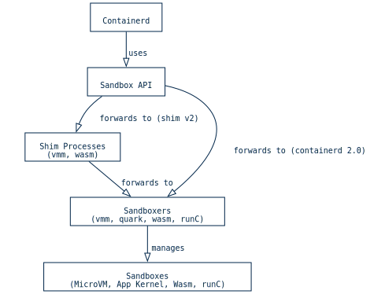
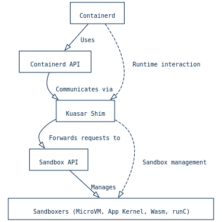
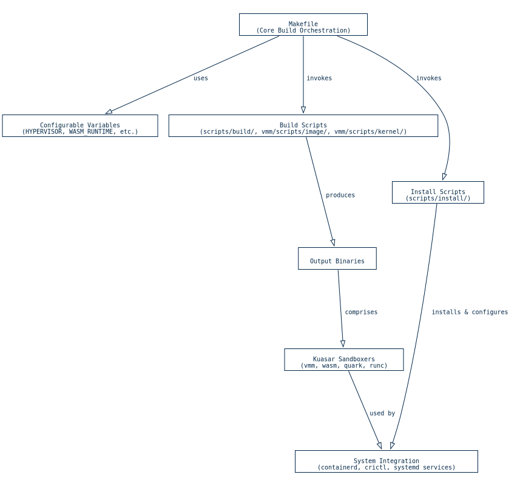

https://codewiki.google/github.com/kuasar-io/kuasar#introduction-to-kuasar-sandboxes

---

Kuasar 是一个多沙盒容器运行时，它统一了多种容器隔离技术于一致的 `Sandbox API` 框架下。它管理 MicroVM、App Kernel、WebAssembly（Wasm）和 `runC` 沙盒。这种做法在安全性和性能之间为云原生应用实现了平衡。

Kuasar 与容器运行时集成，特别是通过 `containerd` 的 `shim proxy` 进行集成。这个代理充当 `CRI runtime V2 backend` ，在 `containerd` 和 Kuasar 的各种沙盒进程之间调解 `Sandbox API` 和 `Task API` 请求。使用 Unix 域套接字（UDS）和 VSock 进行高效通信。更多详情请参考容器运行时集成。
Kuasar 提供不同的沙盒类型，每个都针对不同的隔离需求：

- **MicroVM Sandbox ([`VMM`](https://github.com/kuasar-io/kuasar/blob/a5dc8e2c564405a8c389aaaf3eb708a123059ce1/scripts/install/README.md?plain=1#L132))**: 这个沙盒编排虚拟机环境，抽象设备管理、cgroup 控制、网络和存储。它通过在专用虚拟机中运行工作负载提供强隔离。
- **App Kernel Sandbox ([`Quark`](https://github.com/kuasar-io/kuasar/blob/a5dc8e2c564405a8c389aaaf3eb708a123059ce1/README.md?plain=1#L52))**: `quark-sandboxer` 守护进程使用应用级虚拟机管理器管理容器化环境。这种设置利用定制内核优化性能。
- **WebAssembly Sandbox ([`Wasm`](https://github.com/kuasar-io/kuasar/blob/a5dc8e2c564405a8c389aaaf3eb708a123059ce1/README.md?plain=1#L99))**:  `wasm-sandboxer` 在 WebAssembly 运行时中启动容器，例如 `Wasmtime` 和 `WasmEdge` 。这实现了 Wasm 模块的效率和可移植性执行。
- **[`runC`](https://github.com/kuasar-io/kuasar/blob/a5dc8e2c564405a8c389aaaf3eb708a123059ce1/README.md?plain=1#L53) Sandbox**:  `runc-sandboxer` 提供基于 `runC` 的容器功能，创建隔离的命名空间并管理容器生命周期。

单个居民 `sandboxer` 进程可以管理多个容器，采用 1:N 进程管理模型。与传统的 1:1 `shim v2` 模型相比，这减少了开销，并消除了 `pause containers` 。该项目使用 Rust 实现了许多组件，以提高效率和内存安全性。有关这些功能的更多信息，请参阅多沙盒功能概述和 Kuasar 的核心架构和设计原则。

## Kuasar 沙盒介绍

Kuasar 是一个多沙盒容器运行时，旨在为各种部署场景提供云原生解决方案。它主要使用 Rust 实现，将多种容器隔离技术统一在一致的 `Sandbox API` 框架下，并借鉴了预览的 `containerd` API 的灵感。这种设计使 Kuasar 能够管理多种沙盒类型，包括 MicroVM、App Kernel、Wasm 和 `runC` 沙盒，在安全性、启动速度和标准化之间取得平衡。该项目的架构通过移除 `pause containers` 并采用 1:N 进程管理模型来优化性能，其中单个驻留的 `sandboxer` 进程可以管理多个容器，与传统 1:1 `shim v2` 模型相比，从而降低了开销。

Kuasar 的设计核心围绕几个关键组件和架构原则。它通过专门的沙盒器支持不同的隔离技术。例如，MicroVM 沙盒器（ `vmm-sandboxer` ），位于 `vmm` 目录中，负责协调虚拟机环境，抽象设备管理、cgroup 控制、网络和存储。类似地，App Kernel 沙盒器（ `quark-sandboxer` ）在 `quark` 中，使用应用级虚拟机管理程序管理容器化环境。Wasm 沙盒器（ `wasm-sandboxer` ），位于 `wasm` ，处理 WebAssembly 沙盒和容器，并与 `Wasmtime` 和 `WasmEdge` 等运行时集成。最后， `runC` 沙盒器（ `runc-sandboxer` ）在 `runc` 中，管理基于传统 `runC` 的容器沙盒。

Kuasar 与容器编排系统的集成，特别是与 `containerd` 的集成，通过专门的 shim 实现。这些 shim 位于 `shim` 目录中，作为代理代理，在 `containerd` 和相应的 Kuasar 沙盒进程之间转发 `Sandbox API` 和 `Task API` 请求。这种模块化设计确保 Kuasar 能够扩展其功能到不同的容器环境，同时保持与现有容器生态系统的兼容性。Kuasar 组件的整体构建、安装和测试过程由 `Makefile` 在 `Makefile` 管理，以及位于 `scripts` 的补充脚本处理，从编译自定义 `containerd` 到配置超虚拟机和客户操作系统镜像，涵盖了所有方面。有关构建和安装的更多详细信息，请参阅构建和安装过程。

## Kuasar 的核心架构和设计原则

Kuasar 是一个用 Rust 编写的有效容器运行时，旨在通过多种沙盒技术为各种场景提供云原生解决方案。其核心架构在一致的 `Sandbox API` 下统一了多种隔离技术，实现了安全、启动速度和标准化的平衡。

Kuasar 的一项基础设计原则是 `Multi-Sandbox Colocation` ，它允许不同的沙盒类型——MicroVM、App Kernel、Wasm 和 `runC` ——在单个节点上并发运行。这种方法使用户能够为他们的工作负载选择最合适的隔离级别。例如，MicroVM 沙盒提供强隔离，适合不可信的工作负载，而 `runC` 沙盒为可信应用提供轻量级的容器化。 `Sandbox API` ，正如 `containerd` 所预览的，作为统一接口，抽象掉了每种底层隔离技术的复杂性。这为容器运行时提供了一个一致的管理层，更多细节请参考容器运行时集成。

Kuasar 的 `Optimized Framework` 优先考虑性能和资源效率。一个关键的设计选择是移除 `pause containers` ，并将多个 `shim` 进程替换为单个驻留的 `sandboxer` 进程。这形成了一个 1:N 进程管理模型，其中单个 `sandboxer` 管理多个容器，与传统 1:1 `shim v2` 模型相比显著降低了开销。这种架构在不同沙盒类型中始终如一地实施。例如， `vmm-sandboxer` 编排虚拟机环境， `quark-sandboxer` 管理 App Kernel 沙盒， `wasm-sandboxer` 处理 Wasm 容器。这些沙盒器通过专用适配器与 `containerd` 通信，例如在 `shim` 中找到的适配器，它们转发 `Sandbox API` 和 `Task API` 请求。该项目还维护一个路线图，概述了未来的增强功能和特性，表明持续关注优化和新功能。

整个 Kuasar 项目是用 Rust 语言实现的，这一选择强调了效率、内存安全性和并发性。这一点在主 `(root)` 目录中的源代码组织结构中表现得十分明显，其中核心组件、文档以及每种沙盒类型的工具都被系统地组织起来。在 `Makefile` 的 `Makefile` 中，这些组件的构建、安装和测试被协调管理，展示了一个模块化和可配置的构建过程。该项目还致力于构建一个开放和中立生态系统，正如在 `README.md` 的 `README.md` 中所强调的那样，该生态系统旨在集成多样的沙盒技术并促进社区贡献，具体细节在 `CONTRIBUTING.md` 中有详细说明。

## 多沙盒功能概述

Kuasar 将多种隔离技术统一在一致的 `Sandbox API` 框架下，使多种沙盒类型能在单个节点上并发运行。这种方法在云原生环境中平衡了安全性、启动速度和标准化。其核心架构，如《Kuasar 核心架构与设计原则》所述，利用单个驻留的 `sandboxer` 进程来管理多个容器，通过移除 `pause containers` 优化资源使用并简化进程管理模型。

Kuasar 的多沙盒功能包括：

- **MicroVM Sandbox ([`VMM`](https://github.com/kuasar-io/kuasar/blob/a5dc8e2c564405a8c389aaaf3eb708a123059ce1/scripts/install/README.md?plain=1#L132))**: 该沙盒利用开源虚拟机监视器（VMM）如 `Cloud Hypervisor` 、 `QEMU` 和 `StratoVirt` 来协调虚拟机环境。 `vmm-sandboxer` 负责设备管理、cgroup 控制、网络和存储。在这些虚拟机中， `vmm-task` 组件作为 `init` 进程运行，管理容器和进程的生命周期。更多信息请参阅 [微虚拟机沙盒（ `VMM` ）](#microvm-sandbox-vmm)。
- **App Kernel Sandbox ([`Quark`](https://github.com/kuasar-io/kuasar/blob/a5dc8e2c564405a8c389aaaf3eb708a123059ce1/README.md?plain=1#L52))**: `quark-sandboxer` 守护进程使用应用级虚拟机管理程序管理容器化沙盒环境。这种设置利用定制内核为应用内核工作负载提供优化性能。更多细节可在 [应用内核沙盒（ `Quark` ）](#app-kernel-sandbox-quark) 中找到。
- **WebAssembly Sandbox ([`Wasm`](https://github.com/kuasar-io/kuasar/blob/a5dc8e2c564405a8c389aaaf3eb708a123059ce1/README.md?plain=1#L99))**: `wasm-sandboxer` 在 WebAssembly 运行时（如 `Wasmtime` 和 `WasmEdge` ）中启动容器。这使 Wasm 模块在容器化环境中能够高效和便携地执行。Kuasar 的 `containerd-shim` 集成特别利用这些运行时来执行 Wasm 模块和管理资源限制。更多信息请参阅 [WebAssembly 沙盒（ `Wasm` ）](#webassembly-sandbox-wasm)。
- **[`runC`](https://github.com/kuasar-io/kuasar/blob/a5dc8e2c564405a8c389aaaf3eb708a123059ce1/README.md?plain=1#L53) Sandbox**: `runc-sandboxer` 提供基于 `runC` 的容器功能，通过双重分叉机制创建隔离的命名空间。这些命名空间内的 `runc-task` 管理容器进程，确保与 OCI 规范兼容。更多详情请参阅 [ `runC` 沙盒](#runc-sandbox)。

这些沙盒类型通过一个 shim 代理与 `containerd` 集成，该代理充当 `CRI runtime V2 backend` 。这个代理在 `containerd` 和相应的 Kuasar 沙盒进程之间转发 `Sandbox API` 和 `Task API` 请求，使用 Unix 域套接字（UDS）和 VSock 进行进程间通信。有关此集成的详细说明，请参阅容器运行时集成。

## 构建和安装过程

Kuasar 的构建和安装过程主要通过一个 `Makefile` 和一套 shell 脚本进行协调，这些工具促进了其各种沙盒组件、定制容器运行时和客操作系统实体的编译和部署。该基础设施支持不同的虚拟机管理程序、WebAssembly 运行时和内核版本。

中央 `Makefile` （ `Makefile` ）管理整个构建生命周期，包括编译 `vmm` 、 `wasm` 、 `quark` 和 `runc` 沙盒器。它通过 `HYPERVISOR` （默认值为 `cloud_hypervisor` ）、 `GUESTOS_IMAGE` （默认值为 `centos` ）、 `WASM_RUNTIME` （默认值为 `wasmedge` ）和 `KERNEL_VERSION` 等变量实现灵活配置。这些变量决定了构建哪些与 VMM 相关的组件、使用哪种类型的客户操作系统镜像以及集成特定的 WebAssembly 运行时。 `Makefile` 还负责将编译后的二进制文件和相关 systemd 服务文件安装到标准系统目录中。

与 `Makefile` 相补充， `scripts` 目录包含专门的 shell 脚本。 `scripts/build` 子目录专注于准备关键依赖。例如， `build-containerd.sh` （ `scripts/build/build-containerd.sh` ）自动化编译 Kuasar 特定的 `containerd` 二进制文件，并将其配置为与 Kuasar 的各种沙盒类型（如 `kuasar-runc` 、 `kuasar-vmm` 、 `kuasar-quark` 、 `kuasar-wasm` ）作为 `proxy_plugins` 集成。另一个脚本 `cargo-vendor.sh` （ `scripts/build/cargo-vendor.sh` ）通过为 Kuasar 的子项目提供 Rust 依赖，确保可重复构建，允许离线编译。

`scripts/install` 子目录提供了部署 Kuasar 的详细脚本，特别是 VMM 沙盒器。这些脚本针对不同场景，为 x86_64 和 aarch64 架构提供基于源代码的编译和基于二进制的安装。例如， `build-and-install-kuasar-vmm.sh` （ `scripts/install/build-and-install-kuasar-vmm.sh` ）通过编译 `Cloud-Hypervisor` （Kuasar VMM 沙盒器）、Kuasar 特有的 `containerd` 和 `virtiofsd` 从源代码进行完整安装。它还处理 `crictl` 的安装和配置，利用 Docker 或 Podman 等容器运行时进行隔离构建。为了在 x86_64 上更快部署， `install-kuasar-vmm-x86.sh` （ `scripts/install/install-kuasar-vmm-x86.sh` ）使用相同组件的预编译二进制文件。两种安装方法都包括下载组件的校验和验证，并提供交互式提示以获取用户确认。一个专门的 `uninstall-kuasar-vmm.sh` （ `scripts/install/uninstall-kuasar-vmm.sh` ）脚本提供了一种全面移除 Kuasar 相关组件的方式，包括停止 systemd 服务、删除二进制文件以及清理配置文件。

此外，VMM 组件在 `vmm/scripts` 中包含用于生成客机操作系统根文件系统和镜像的专业脚本。这涉及创建与 Kata Containers 兼容的镜像，并构建基于 CentOS 的根文件系统。 `vmm/scripts/kernel` 中的脚本用于为各种 VMM（如 Cloud Hypervisor、QEMU 和 StratoVirt）定制 Linux 内核镜像，并为 Kuasar 安全容器定制内核，通常针对最小内存占用进行优化。

## 文档与社区资源

Kuasar 提供了各种资源来促进理解、集成和社区参与。

在 `docs` 目录中提供全面的文档。这包括有关将 Kuasar 与 `containerd` 等容器运行时集成的详细指南，概述了 `shim proxy` 的功能以及 `vmm` 、 `quark` 和 `wasm` 沙盒器的配置。还提供了针对不同虚拟机管理程序（如 QEMU 和 StratoVirt）构建、安装和配置 Kuasar 的具体说明。此外，文档还提供了在 Kubernetes 中部署基于 Wasm 的大型语言模型（LLM）推理应用程序的指导，展示了 Kuasar Wasm 能力的实际应用。

除了文档之外，该项目通过多种途径鼓励社区参与。 `ROADMAP.md` 文件概述了核心框架、测试、Kubernetes 功能支持和安全方面的未来开发计划及改进。贡献由 `CONTRIBUTING.md` 指导，其中详细说明了工作流程、代码审查过程和提交信息格式标准。 `CODE_OF_CONDUCT.md` 文件确立了社区期望，并参考了 CNCF 行为准则。 `ADOPTERS.md` 中提供了采用 Kuasar 的组织和项目的相关信息，而 `MAINTAINERS.md` 列出了官方项目维护者和团队。变更和版本历史计划在 `CHANGELOG` 目录中进行跟踪。
