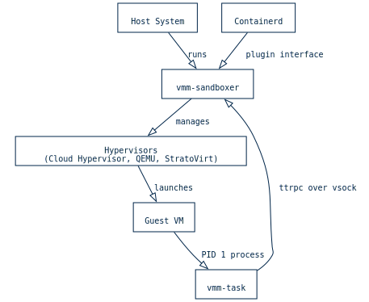
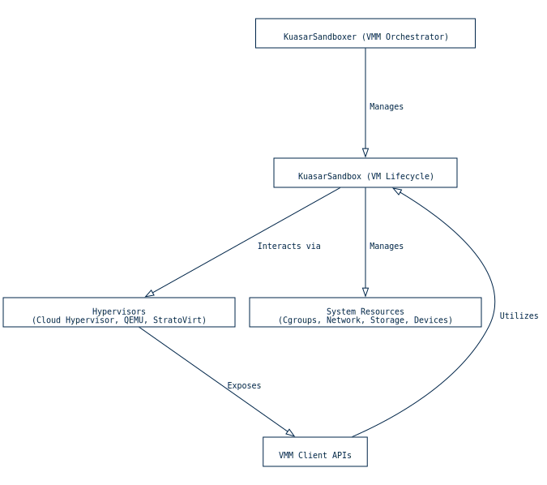
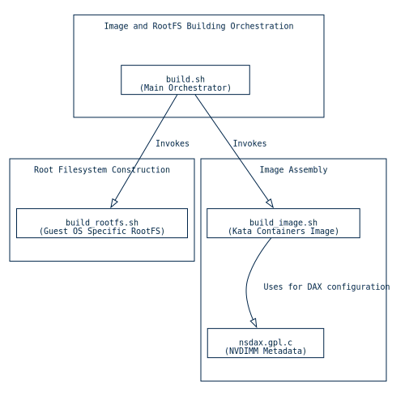
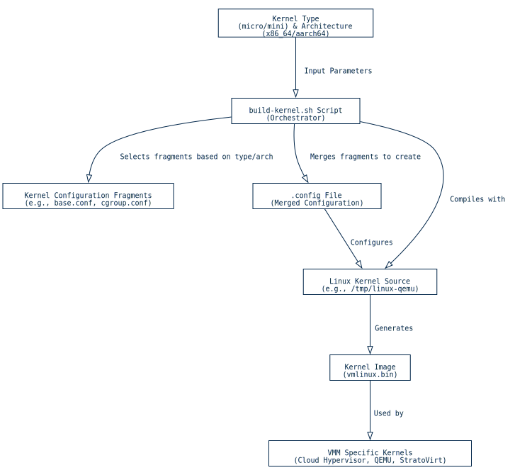
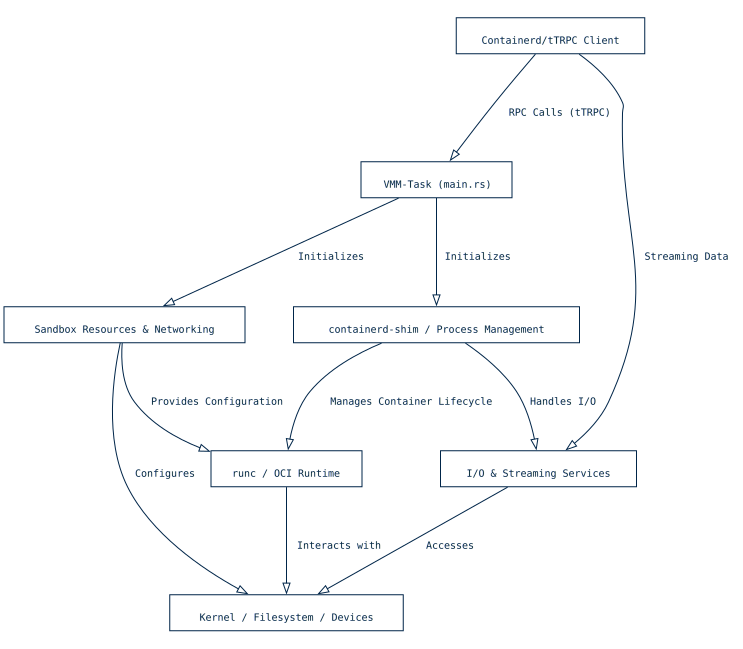
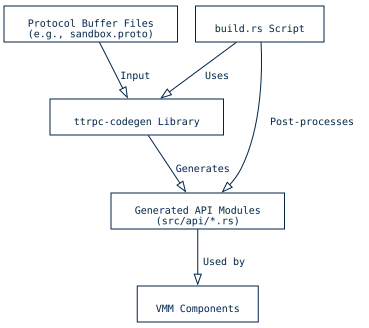
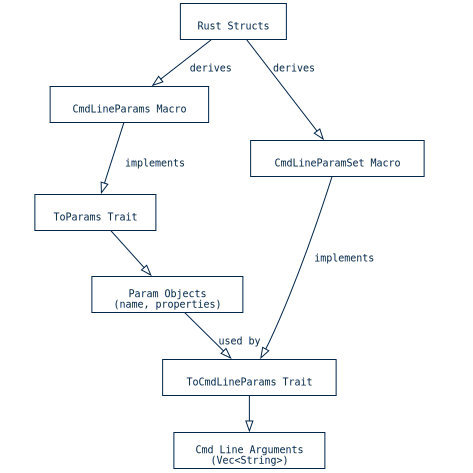

https://codewiki.google/github.com/kuasar-io/kuasar#microvm-sandbox-vmm

---

Kuasar 的 MicroVM (VMM) 沙箱实现利用虚拟机技术，为容器工作负载提供了一个强大且隔离的环境。这项功能是 Kuasar 多沙箱方法的核心，它在提供强大隔离保障的同时，还能保持性能。VMM 沙箱为每个沙箱编排一个虚拟机，抽象化了复杂的设备管理、cgroup 控制、网络和存储配置。这种抽象化使得容器能够在专用的虚拟机中运行，从而确保它们与其他容器和宿主机系统完全隔离。

VMM 沙箱环境的核心由几个关键组件构成。 vmm-sandboxer 组件负责协调虚拟机的生命周期，包括启动、停止和管理这些 microvm 的资源。在每个客户虚拟机内部，一个名为 vmm-task 轻量级进程以进程 ID 1 运行。该 vmm-task 负责管理客户虚拟机内部的容器和进程生命周期，处理资源分配、网络配置和异步 I/O 操作。主机与客户虚拟机的 vmm-task 之间的通信主要依赖于基于 vsock ttrpc ，从而实现高效的进程间通信，而无需将客户虚拟机的网络暴露给主机。

为了支持各种虚拟机管理程序，例如 Cloud Hypervisor、QEMU 和 StratoVirt，Kuasar 的 VMM 沙箱提供了灵活的集成机制。这包括针对特定虚拟机管理程序的客户端 API 和生命周期管理。该系统还支持针对这些不同的 VMM 和 Kuasar 安全容器对 Linux 内核镜像进行广泛的定制。这种定制（详见“微型虚拟机的 Linux 内核定制” 小节）通常侧重于优化内核以实现最小的内存占用，并根据具体用例将其分为 micro-kernel 或 mini-kernel 。

创建客户操作系统环境涉及多个构建过程。这包括构建客户操作系统根文件系统和镜像、编译 vmm-task 和 runc 二进制文件，以及配置 NVDIMM/DAX 头文件以优化性能。这些过程由脚本协调，以确保客户环境为容器执行做好充分准备。

VMM 沙箱利用过程宏简化了从 Rust 结构体生成命令行参数的过程，从而增强了可配置性和可维护性。这些宏将结构化的 Rust 数据转换为结构化的参数对象或原始命令行参数字符串，方便对虚拟机管理程序和客户机环境进行动态配置。更多信息，请参阅 “使用过程宏派生命令行参数”。

总的来说，Kuasar 的 VMM 沙箱为安全隔离的容器执行提供了一个强大而灵活的解决方案，它通过其 shim proxy 架构与现有的容器运行时（如 containerd 紧密集成，如容器运行时集成中所述。

## VMM 编排和 Hypervisor 集成

Kuasar 通过其核心组件 KuasarSandboxer 和 KuasarSandbox ，协调虚拟机 (VM) 沙箱环境，抽象化设备管理、cgroup 控制、网络和存储。该架构支持与各种 Hypervisor（例如 Cloud Hypervisor、QEMU 和 StratoVirt）集成，每种管理程序都由特定的客户端 API 和生命周期管理提供支持。

定义在 vmm/sandbox/src/sandbox.rs 中的 KuasarSandboxer 和 KuasarSandbox 结构体分别实现了 Sandboxer 和 Sandbox 特性，用于管理 KuasarSandbox 实例、其虚拟机和容器的集合。KuasarSandboxer 负责整个沙箱的创建、启动、停止、删除和恢复。 KuasarSandbox KuasarSandboxer 一个基于虚拟机的沙箱，负责管理其 vm 、容器、网络配置以及与 SandboxServiceClient 通信。这包括诸如持久化和恢复沙箱状态、初始化 ttrpc 连接、在虚拟机内设置沙箱以及同步时钟等操作。

不同的虚拟机管理程序实现，包括 Cloud Hypervisor（ vmm/sandbox/src/cloud_hypervisor 中的 CloudHypervisorVM 、 CloudHypervisorVMConfig 和 ChClient ）、 QemuVM （ vmm/sandbox/src/qemu 中的 QemuVMConfig 、 StratoVirtVM 和 QmpClient ）以及 StratoVirt（ vmm/sandbox/src/stratovirt 中的 StratoVirtVM、 StratoVirtVMConfig 和 QmpClient ），提供了特定的 VM 和配置结构。这些实现定义了用于创建虚拟机实例 Hooks VMFactory 接口，以及用于启动、停止、挂载、分离和健康检查等操作的 VM 接口。Hooks 特性允许在虚拟机生命周期中注入自定义逻辑，例如 pre_start 和 post_start 操作，而 Recoverable 特性则允许在重启后恢复虚拟机状态。

设备管理由通用的 Device 和 Bus 特性抽象化，这些特性定义在 vmm/sandbox/src/device.rs 文件中，块设备、网络设备和控制台的具体实现则位于相应的虚拟机管理程序目录中。例如， vmm/sandbox/src/cloud_hypervisor/devices 管理 cloud_hypervisor 的设备。类似地，资源隔离的 cgroup 控制由 vmm/sandbox/src/cgroup.rs 处理，该文件提供了创建分层 cgroup、应用资源限制和分配进程的功能。网络配置（包括 NetworkInterface 和 IP 地址管理）在 vmm/sandbox/src/network 目录中进行管理，而存储连接则由 vmm/sandbox/src/storage 进行管理。

这些 VMM 沙箱的命令行参数源自 Rust 结构体，并使用了诸如 CmdLineParams 和 CmdLineParamSet 之类的过程宏，详情请参阅“使用过程宏派生命令行参数” 一文，从而能够动态生成 cloud-hypervisor 和 virtiofsd 的参数。每个 VMM 后端的 KuasarSandboxer 入口点位于 vmm/sandbox/src/bin 目录下，负责协调参数解析、配置加载（例如， vmm/sandbox/src/config.rs 中的 Config::load_config ）、跟踪、信号处理和状态恢复。

客户端与沙箱服务的通信由位于 vmm/sandbox/src/client.rs 中的 SandboxServiceClient 管理，它支持 ttrpc 连接，并支持多种套接字类型（Unix、VSock、HVSock），用于执行诸如健康检查、沙箱设置和时钟同步等操作。关于 ttrpc 协议和代码生成等整体架构，包括如何从 protobuf 定义生成 Rust 代码，在 “TTRPC 协议和代码生成”一节中有更详细的阐述。

## Guest OS 镜像和根文件系统生成

在 Kuasar 中构建客户操作系统根文件系统和镜像的过程涉及多个精心编排的步骤，旨在为各种虚拟机监控器 (VMM) 创建定制环境。主要的编排工作由 vmm/scripts/image/build.sh 脚本负责，该脚本管理根文件系统的创建，并可选择性地生成 initrd 或完整的可引导镜像。此脚本支持不同的容器运行时环境，包括 containerd 、 docker 和 isulad ，以便在容器化环境中执行根文件系统构建过程。

为了构建完整的与 Kata Containers 兼容的根文件系统镜像，需要使用 vmm/scripts/image/build_image.sh 中的脚本。该脚本会验证根文件系统，计算最佳磁盘大小，使用 qemu-img 创建原始磁盘镜像，并使用 parted 对其进行分区。然后，它会格式化根分区（支持 ext4 或 xfs ），复制根文件系统的内容，并在启用 AGENT_INIT 时优化 systemd 组件以减小镜像大小。一个值得注意的特性是可以使用 nsdax 工具配置 NVDIMM/DAX 标头，该工具会插入特定的元数据以启用支持 pmem 的 NVDIMM 设备功能。

基于 CentOS 的根文件系统使用 vmm/scripts/image/centos/build_rootfs.sh 中的脚本构建。此过程包括构建 Kuasar 的 vmm-task 二进制文件、安装 Go 运行时环境、编译 runc 二进制文件，然后将这些组件以及必要的 glibc 库和列表中指定的其他 RPM 包填充到一个临时根文件系统目录中。许多常用的构建工具（例如用于构建 vmm-task 和 runc 工具）集中在 vmm/scripts/image/common.sh 中，从而提高了模块化程度，并允许在不同根文件系统构建中重复使用。Rust 工具链（ vmm-task 的依赖项）的安装由 vmm/scripts/image/install_rust.sh 处理，该脚本确保安装 rustup 并添加用于交叉编译的 unknown-linux-musl 目标。

nsdax 工具（实现于 vmm/scripts/image/nsdax.gpl.c ）对于配置 NVDIMM/DAX 头部至关重要。该 C 工具会将 PFN（页帧号）元数据块嵌入到 NVDIMM 镜像文件中。该元数据块基于 Linux 内核 NVDIMM 驱动程序，包含数据偏移和对齐等信息，使内核能够正确解析 NVDIMM 区域。该工具的 main 功能是解析命令行参数，初始化 nd_pfn_sb 结构，使用 nd_fletcher64 和 nd_sb_checksum 计算其校验和，并将该结构写入镜像中的特定偏移量 ( SZ_4K )。这样就实现了双主引导记录 (MBR) 设置，支持 DAX 的系统可以读取第二个 MBR，而其他系统则读取第一个 MBR。

## 针对 microvm 的 Linux 内核定制

Kuasar 项目包含一个专用框架，用于构建和定制适用于各种虚拟机监控器 (VMM) 和安全容器的 Linux 内核镜像。该流程强调一种“添加式”定制方法，旨在最大限度地减少内存占用和冷启动时间。与从完整的内核配置开始并移除功能不同，该方法选择性地添加必要的功能，从而可以精确控制内核的资源消耗和性能。

内核定制框架主要在 vmm/scripts/kernel 目录下管理，支持多种虚拟机管理程序 (VMM)，包括 Cloud Hypervisor、QEMU 和 StratoVirt，以及 Kuasar 安全容器。 vmm/scripts/kernel/build-kernel/build-kernel.sh 脚本负责协调此过程，根据目标架构和内核类型动态选择配置片段。它使用内核构建系统工具将这些片段合并，从而在编译前生成最终的 .config 文件。

支持两种主要的定制内核类型：

- micro-kernel ：专为无服务器和轻量级虚拟机设计，这些内核优先考虑最小的内存开销和低延迟，通常采用 MMIO 总线结构。

- mini-kernel ：这些内核提供更复杂应用程序所需的高级功能，例如 ACPI、SCSI、NFS 和对内核模块的支持，通常使用 PCI 总线结构。

kernel 目录中的特定构建脚本处理每个虚拟机管理程序 (VMM) 的细微差别。例如， vmm/scripts/kernel/cloud_hypervisor/build.sh 专门用于在 x86-64 上为 Cloud Hypervisor 构建 vmlinux.bin ，而 vmm/scripts/kernel/qemu/build.sh 则专注于为 QEMU 生成 bzImage ，并启用 BLK_DEV_INITRD 和 VIRTIO 驱动程序等关键选项。类似地， vmm/scripts/kernel/stratovirt/build.sh 构建专为 openEuler 和 StratoVirt 定制的 aarch64 vmlinux.bin 镜像。

“附加”定制方法的设计选择确保仅包含对 Kuasar VMM 沙箱至关重要的功能，从而缩小攻击面，增强安全态势，并提升性能。有关该方法和性能影响的更多详细信息，请参阅 vmm/scripts/kernel/build-kernel/how-to-tailor-linux-kernel-for-kuasar-security-container.md 。

## VMM 任务生命周期和运行时管理

vmm-task 组件负责协调客户虚拟机 (VM) 环境中容器和进程的生命周期。它在客户虚拟机内部以进程 ID 1 运行，管理初始化、资源分配、网络和异步 I/O。该系统利用 ttrpc 进行进程间通信，并利用 tokio 实现并发，从而能够高效地管理容器工作负载。

vmm-task 服务的主要入口点位于 vmm/task/src/main.rs 。该组件初始化虚拟机环境，设置必要的文件系统和内核参数。它还配置一个 ttrpc 服务器，以公开用于管理任务、沙箱和流式传输的服务，从而允许外部组件与虚拟机的内部进程交互。vmm vmm-task 还处理操作系统信号，包括回收子进程和管理优雅关机。

vmm-task 的配置参数由 vmm/task/src/config.rs 中的 TaskConfig 结构管理。该配置通过解析 /proc/cmdline 中的内核命令行参数动态确定，从而允许在运行时进行灵活调整，而无需依赖外部配置文件。

vmm-task 中的容器和进程管理由 shim 层负责，该层在 vmm/task/src/container.rs 中实现。此层充当 containerd 和符合 OCI 标准的运行时（例如 runc 之间的中介。它负责创建容器、解析 OCI Spec 、设置存储以及管理 stdio 重定向。该组件区分初始容器进程和后续 exec 进程，从而提供不同的生命周期管理。一个值得注意的设计是 ShimExecutor ，这是一个自定义的 spawner，它与 containerd-shim 监控系统集成，可以精确地跟踪进程生命周期。错误报告机制完善，可以从 runc 日志文件中提取详细信息。vmm vmm-task 还与 SandboxResources 集成，以管理容器存储生命周期。

沙箱的资源管理集中在 vmm/task/src/sandbox.rs 中的 SandboxResources 内。该组件负责管理存储卷，包括添加、延迟和垃圾回收。它与 vmm/task/src/device.rs 中的 DeviceMonitor 交互 DeviceMonitor 以跟踪和管理块设备和 SCSI 设备。DeviceMonitor 监听内核 uevent，并允许其他组件订阅设备相关事件，从而确保系统能够感知可用硬件。此外， vmm/task/src/sandbox.rs 还负责设置 Linux 命名空间（IPC、UTS、PID）并配置 sysctl 参数以维护沙箱的隔离性。vmm vmm/task/src/mount.rs 中的 get_cgroup_mounts 函数生成必要的 cgroup 挂载配置，支持 v1 和 v2 层次结构。

网络配置由位于 vmm/task/src/netlink.rs Handle 结构处理。该组件提供了一个基于 rtnetlink 高级 API，用于管理客户虚拟机内的网络接口、IP 地址和路由表，通常供代理服务使用。这包括启用环回、更新接口、添加和删除 IP 地址以及管理路由等操作，所有这些操作都使用 protobuf 定义的结构，以实现无缝的 RPC 集成。

I/O 和流管理对于容器功能至关重要，并在 vmm/task/src/io.rs 文件中实现。该文件定义了 ProcessIO 及相关函数，用于管理容器进程的 stdin 、 stdout 和 stderr ，支持多种机制，例如 FIFO、控制台套接字、直接流和 vsock 。它还处理控制台连接，提供用于数据复制的异步函数，并包含一个符合 AsyncRead 和 AsyncWrite 特性的 vsock 流的 VsockIo 实现。vmm vmm/task/src/streaming.rs 中的 Streaming 服务通过 ttrpc 实现流功能，管理标准流的 I/O 通道。此外， vmm/task/src/debug.rs 提供了通过 VSOCK 建立调试控制台的功能，为虚拟机或容器提供 shell 接口。

## TTRPC 协议和代码生成

Kuasar 虚拟机监控器 (VMM) 利用 ttrpc 进行进程间通信，而 ttrpc 依赖于从 protobuf 定义生成 Rust 代码。此代码生成过程由 vmm/common/build.rs 构建脚本管理，实现了不同 VMM 组件之间无缝的数据交换和远程过程调用。

vmm/common/build.rs 脚本利用 ttrpc-codegen crate 将 .proto 文件（例如 sandbox.proto 、 events.proto 和 fieldpath.proto ）转换为 Rust 源代码。生成的代码为 ttrpc 协议提供了必要的客户端和服务端实现，确保类型安全且高效的通信。例如， vmm/common/src/api/mod.rs 中的 sandbox_ttrpc 和 streaming_ttrpc 模块分别提供了沙箱管理和数据流服务的特定 ttrpc 绑定。

为了维护代码质量并抑制自动生成文件中不必要的警告，构建脚本会进行一些生成后修改。它会移除 ` #![allow(box_pointers)] ` 代码检查，该检查用于解决与特定 Rust 特性的兼容性问题，并将 #![allow(clippy::all)] 插入到生成的 _ttrpc.rs 文件中。这确保了自动生成的代码中可能出现的 clippy 警告被抑制，从而保持代码库的整洁，使其专注于开发者编写的逻辑。这使得项目能够专注于生成的 API 组件的语义正确性，而不会被那些并非由开发者直接维护的代码的风格检查所分散注意力。

## 使用过程宏推导命令行参数

Kuasar 利用过程宏从 Rust 结构体生成命令行参数，简化了定义和解析各种组件参数的过程。这种方法支持两种主要的生成方式：创建结构化的 Param 对象和生成原始命令行参数字符串。这些宏定义在 vmm/sandbox/derive/src/lib.rs 文件中。

CmdLineParams 宏为 crate::param::ToParams trait 生成一个实现，产生一个 crate::param::Param 对象向量。每个 Param 对象代表一个结构化参数，包含一个名称和一个 Property 对象列表。这使得命令行参数能够以详细且有序的方式表示，其中参数中的每个属性都可以具有特定的配置，例如 param 、 key 、 predicate 、 generator 、 ignore_key 和 ignore 属性。这些属性支持对属性生成进行动态控制，允许基于 Rust 表达式有条件地包含或转换值。

相反， CmdLineParamSet 宏会为 ` crate::param::ToCmdLineParams trait 生成一个实现，该实现会输出一个表示原始命令行参数的 String 向量。此宏处理结构体字段，并使用带有 key 和 ignore 子属性的 param 属性来自定义命令行键或排除字段。它按类型（例如布尔值、原始类型、 Vec 或 Option ）对字段进行分类，并将参数生成委托给专门的 ` crate::param 类型。这种方法通过抽象将 Rust 数据结构转换为可执行参数的过程，简化了命令行接口的创建。

这两个宏 convert_case 利用 syn 和 quote crate 来解析 Rust 语法树和生成新的 Rust 代码。convert_case crate 用于将标识符转换为 kebab-case 格式，以确保生成的命令行参数格式一致。

