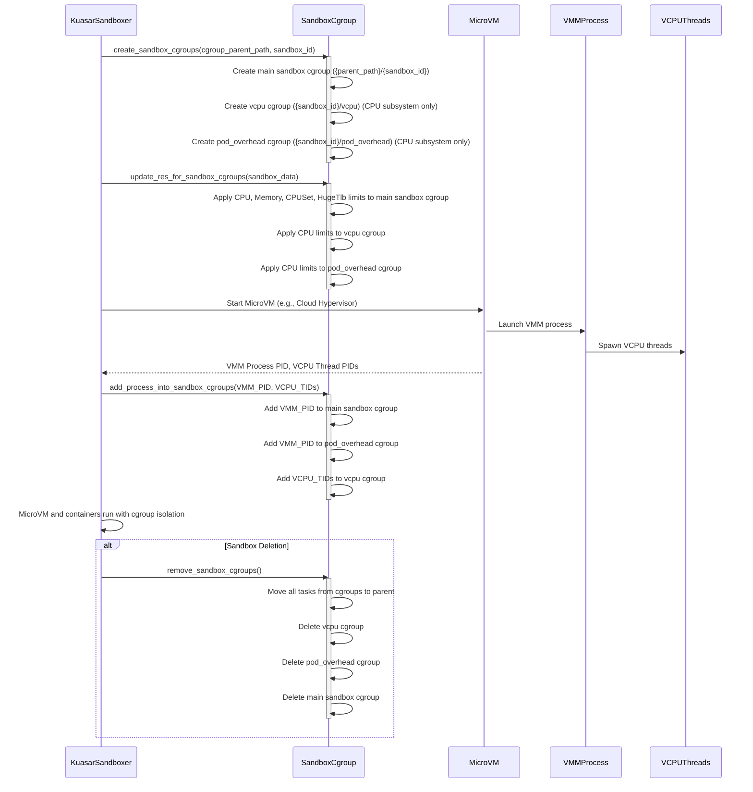

内容来自 code wiki.

----

## cgroup

问：当我在一个 bms 上创建多个 cloud hypervisor 的 microvm 时，cgroup 是如何设计的？什么时候创建 cgroup？

当在 bare-metal server (BMS) 上创建多个 Cloud Hypervisor microVM 时，Kuasar 会为每个 sandbox 设计和管理 cgroup，以实现资源隔离和控制。

### Cgroup 的设计和创建时间

1. **Sandbox Cgroup 的创建：**
   - 当 [`KuasarSandboxer`](https://github.com/kuasar-io/kuasar/blob/a5dc8e2c564405a8c389aaaf3eb708a123059ce1/vmm/sandbox/src/sandbox.rs#L57) 收到创建 sandbox 的请求时，它会首先尝试为该 sandbox 创建 cgroup。
   - 在 [`KuasarSandboxer`](https://github.com/kuasar-io/kuasar/blob/a5dc8e2c564405a8c389aaaf3eb708a123059ce1/vmm/sandbox/src/sandbox.rs#L57) 的 [`create`](https://github.com/kuasar-io/kuasar/blob/a5dc8e2c564405a8c389aaaf3eb708a123059ce1/runc/src/runc.rs#L115) 方法中 ( `kuasar-io/kuasar/vmm/sandbox/src/sandbox.rs` )，会调用 [`SandboxCgroup::create_sandbox_cgroups`](https://github.com/kuasar-io/kuasar/blob/a5dc8e2c564405a8c389aaaf3eb708a123059ce1/vmm/sandbox/src/cgroup.rs#L282) 函数 ( `kuasar-io/kuasar/vmm/sandbox/src/cgroup.rs` )。
   - 这个函数会创建一个主 sandbox cgroup，路径格式为 `{cgroup_parent_path}/{sandbox_id}`。默认的 [`cgroup_parent_path`](https://github.com/kuasar-io/kuasar/blob/a5dc8e2c564405a8c389aaaf3eb708a123059ce1/vmm/sandbox/src/cgroup.rs#L39) 是 [`"kuasar-vmm"`](https://github.com/kuasar-io/kuasar/blob/a5dc8e2c564405a8c389aaaf3eb708a123059ce1/Makefile#L86) ( `kuasar-io/kuasar/vmm/sandbox/src/cgroup.rs` )，但也可以通过 [`PodSandboxConfig`](https://github.com/kuasar-io/kuasar/blob/a5dc8e2c564405a8c389aaaf3eb708a123059ce1/quark/src/sandbox.rs#L86) 中的 [`cgroup_parent`](https://github.com/kuasar-io/kuasar/blob/a5dc8e2c564405a8c389aaaf3eb708a123059ce1/vmm/sandbox/src/utils.rs#L501) 字段来指定，例如 Kubernetes 环境下可能为 [`/kubepods/burstable/podxxx`](https://github.com/kuasar-io/kuasar/blob/a5dc8e2c564405a8c389aaaf3eb708a123059ce1/vmm/sandbox/src/cgroup.rs#L228) ( `kuasar-io/kuasar/vmm/sandbox/src/cgroup.rs` [`create_mock_pod_sandbox_config`](https://github.com/kuasar-io/kuasar/blob/a5dc8e2c564405a8c389aaaf3eb708a123059ce1/vmm/sandbox/src/cgroup.rs#L225) 函数)。
   - 除了主 sandbox cgroup，还会创建两个子 cgroup：
      - [`vcpu`](https://github.com/kuasar-io/kuasar/blob/a5dc8e2c564405a8c389aaaf3eb708a123059ce1/vmm/sandbox/src/cgroup.rs#L33) cgroup (`kuasar-io/kuasar/vmm/sandbox/src/cgroup.rs`)，用于管理 vCPU 相关的 CPU 资源。
      - [`pod_overhead`](https://github.com/kuasar-io/kuasar/blob/a5dc8e2c564405a8c389aaaf3eb708a123059ce1/vmm/sandbox/src/cgroup.rs#L34) cgroup (`kuasar-io/kuasar/vmm/sandbox/src/cgroup.rs`)，用于管理 pod overhead 相关的 CPU 资源。
   - **创建时机：** 这些 cgroup 在 [`KuasarSandboxer`](https://github.com/kuasar-io/kuasar/blob/a5dc8e2c564405a8c389aaaf3eb708a123059ce1/vmm/sandbox/src/sandbox.rs#L57) 处理 `CreateSandbox` 请求时，VM 启动之前被创建。
2. **资源限制的应用：**
   - cgroup 创建后，[`KuasarSandboxer`](https://github.com/kuasar-io/kuasar/blob/a5dc8e2c564405a8c389aaaf3eb708a123059ce1/vmm/sandbox/src/sandbox.rs#L57) 会调用 [`sandbox_cgroups.update_res_for_sandbox_cgroups`](https://github.com/kuasar-io/kuasar/blob/a5dc8e2c564405a8c389aaaf3eb708a123059ce1/vmm/sandbox/src/cgroup.rs#L353) ( `kuasar-io/kuasar/vmm/sandbox/src/sandbox.rs` ) 来应用资源限制。
   - 这个函数 ( `kuasar-io/kuasar/vmm/sandbox/src/cgroup.rs` ) 会根据 [`SandboxData`](https://github.com/kuasar-io/kuasar/blob/a5dc8e2c564405a8c389aaaf3eb708a123059ce1/shim/src/data.rs#L77) 中定义的资源 ([`LinuxContainerResources`](https://github.com/kuasar-io/kuasar/blob/a5dc8e2c564405a8c389aaaf3eb708a123059ce1/vmm/sandbox/src/utils.rs#L32)) 对主 sandbox cgroup 应用 CPU、内存、cpuset 和 hugetlb 资源限制。
   - [`vcpu`](https://github.com/kuasar-io/kuasar/blob/a5dc8e2c564405a8c389aaaf3eb708a123059ce1/vmm/sandbox/src/cgroup.rs#L33) 和 [`pod_overhead`](https://github.com/kuasar-io/kuasar/blob/a5dc8e2c564405a8c389aaaf3eb708a123059ce1/vmm/sandbox/src/cgroup.rs#L34) cgroup 仅应用 CPU 资源限制 ( `kuasar-io/kuasar/vmm/sandbox/src/cgroup.rs` )。
   - **应用时机：** 资源限制在 sandbox cgroup 创建后立即应用，同样在 VM 启动之前。
3. **VMM 进程和 VCPU 线程加入 Cgroup：**
   - 当 MicroVM 启动后，[`vmm-sandboxer`](https://github.com/kuasar-io/kuasar/blob/a5dc8e2c564405a8c389aaaf3eb708a123059ce1/Makefile#L23) 会获取 VMM 进程的 PID 和其 vCPU 线程的 PID ( `kuasar-io/kuasar/vmm/sandbox/src/sandbox.rs` )。
   - 它会调用 `sandbox_cgroups.add_process_into_sandbox_cgroups` ( `kuasar-io/kuasar/vmm/sandbox/src/cgroup.rs` )：
      - 将 VMM 主进程加入到主 sandbox cgroup 和 [`pod_overhead`](https://github.com/kuasar-io/kuasar/blob/a5dc8e2c564405a8c389aaaf3eb708a123059ce1/vmm/sandbox/src/cgroup.rs#L34) cgroup 中。
      - 将所有 vCPU 线程加入到 [`vcpu`](https://github.com/kuasar-io/kuasar/blob/a5dc8e2c564405a8c389aaaf3eb708a123059ce1/vmm/sandbox/src/cgroup.rs#L33) cgroup 中。
   - **加入时机：** VMM 进程和 VCPU 线程在 MicroVM 启动并获取到其 PID 后，通过 [`add_to_cgroup`](https://github.com/kuasar-io/kuasar/blob/a5dc8e2c564405a8c389aaaf3eb708a123059ce1/vmm/sandbox/src/sandbox.rs#L687) 方法 ( `kuasar-io/kuasar/vmm/sandbox/src/sandbox.rs` ) 加入到相应的 cgroup 中。
4. **Cgroup V1 和 V2 的支持：**
   - 目前 Kuasar 主要支持 cgroup V1 ( `kuasar-io/kuasar/vmm/sandbox/src/cgroup.rs` )。
   - [`vmm-task`](https://github.com/kuasar-io/kuasar/blob/a5dc8e2c564405a8c389aaaf3eb708a123059ce1/Makefile#L23) ([`PID 1`](https://github.com/kuasar-io/kuasar/blob/a5dc8e2c564405a8c389aaaf3eb708a123059ce1/README.md?plain=1#L125) 在 Guest VM 内) 也会处理 cgroup 的挂载配置，[`get_cgroup_mounts`](https://github.com/kuasar-io/kuasar/blob/a5dc8e2c564405a8c389aaaf3eb708a123059ce1/vmm/task/src/mount.rs#L42) 函数 ( `kuasar-io/kuasar/vmm/task/src/mount.rs` ) 会根据 [`unified_cgroup_hierarchy`](https://github.com/kuasar-io/kuasar/blob/a5dc8e2c564405a8c389aaaf3eb708a123059ce1/vmm/task/src/mount.rs#L44) 参数生成 cgroup 挂载点，支持 cgroup v1 和 v2 两种模式，确保 Guest VM 内的 cgroup 视图正确。
5. **Cgroup 的清理：**
   - 当 sandbox 被删除时，[`KuasarSandboxer`](https://github.com/kuasar-io/kuasar/blob/a5dc8e2c564405a8c389aaaf3eb708a123059ce1/vmm/sandbox/src/sandbox.rs#L57) 会调用 [`sandbox_cgroups.remove_sandbox_cgroups`](https://github.com/kuasar-io/kuasar/blob/a5dc8e2c564405a8c389aaaf3eb708a123059ce1/vmm/sandbox/src/cgroup.rs#L419) ( `kuasar-io/kuasar/vmm/sandbox/src/cgroup.rs` ) 来清理所有相关的 cgroup。
   - 清理过程包括将 cgroup 中的任务移动到父 cgroup，然后删除子 cgroup 和主 cgroup。
   - **清理时机：** 在 [`KuasarSandboxer`](https://github.com/kuasar-io/kuasar/blob/a5dc8e2c564405a8c389aaaf3eb708a123059ce1/vmm/sandbox/src/sandbox.rs#L57) 的 [`delete`](https://github.com/kuasar-io/kuasar/blob/a5dc8e2c564405a8c389aaaf3eb708a123059ce1/runc/src/runc.rs#L336) 方法中 ( `kuasar-io/kuasar/vmm/sandbox/src/sandbox.rs` )。

总结：

Kuasar 在创建每个 MicroVM sandbox 时，会在宿主机上动态创建一套分层的 cgroup 结构 ([`sandbox`](https://github.com/kuasar-io/kuasar/blob/a5dc8e2c564405a8c389aaaf3eb708a123059ce1/shim/src/data.rs#L78) -> [`vcpu`](https://github.com/kuasar-io/kuasar/blob/a5dc8e2c564405a8c389aaaf3eb708a123059ce1/vmm/sandbox/src/cgroup.rs#L33)/[`pod_overhead`](https://github.com/kuasar-io/kuasar/blob/a5dc8e2c564405a8c389aaaf3eb708a123059ce1/vmm/sandbox/src/cgroup.rs#L34))。这些 cgroup 在 VM 启动前创建并配置资源限制，在 VM 启动后将 VMM 进程和 vCPU 线程加入相应的 cgroup 进行管理，以确保每个 MicroVM 及其内部组件都运行在预定义的资源限制内，从而实现多个 MicroVM 在 BMS 上的隔离和高效运行。

