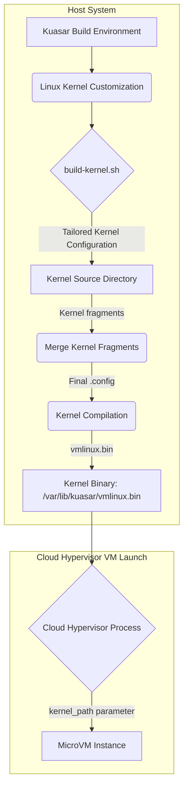
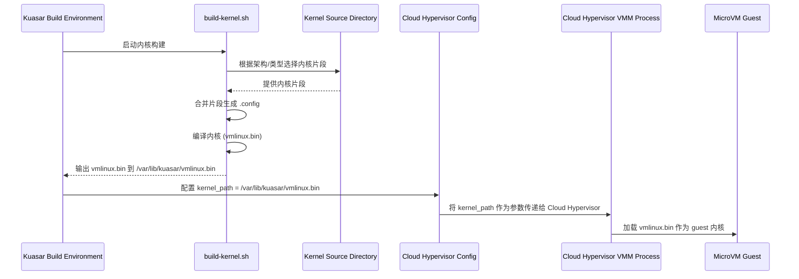
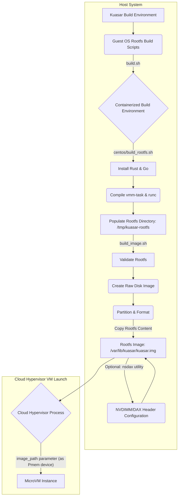
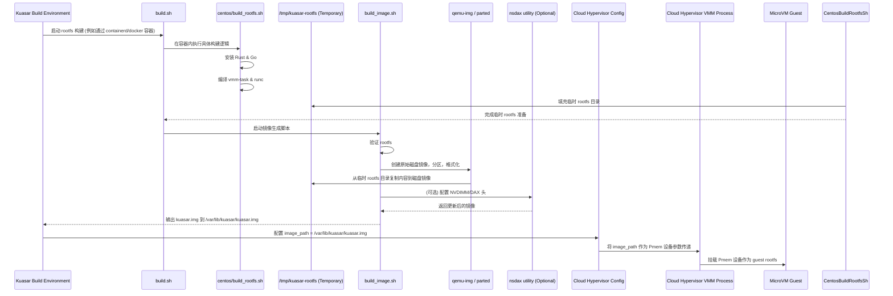
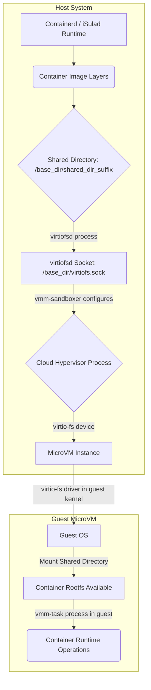
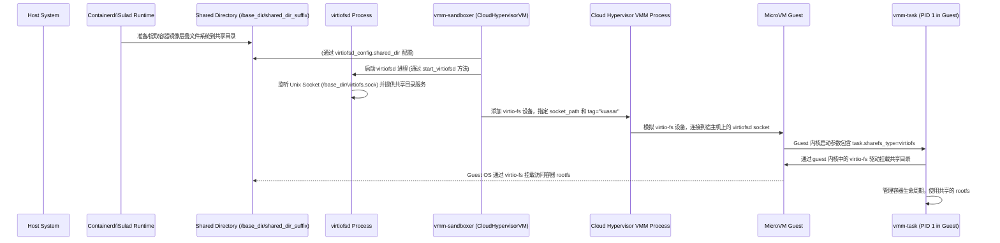
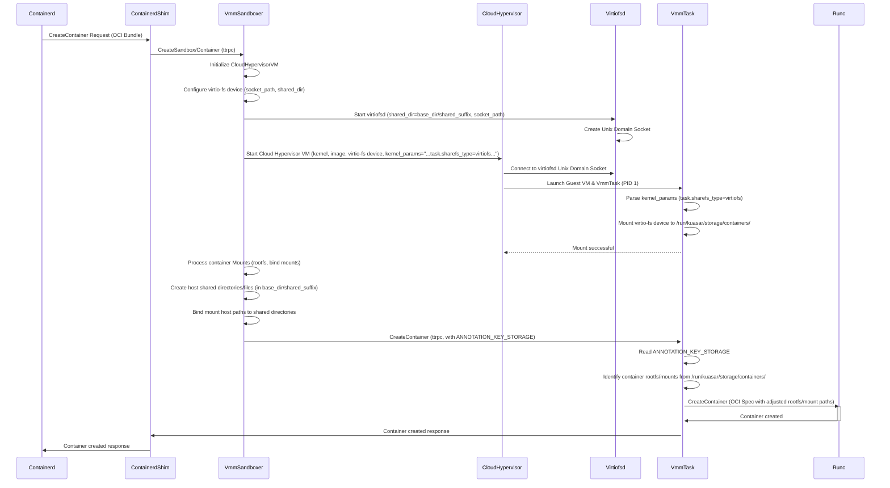

内容来自 code wiki.

----

## 文件传递

问： 仅仅考虑通过 cloud hypervisor 启动 microvm 的过程，kuasar 是如何将容器镜像，虚拟机 rootfs，kernel 等文件传递给 cloud hypervisor 并启动 microvm 实例的？

在 Kuasar 中，通过 Cloud Hypervisor 启动 MicroVM 实例时，容器镜像、虚拟机 rootfs 和 kernel 等文件通过以下方式传递和使用：

1. **内核 (Kernel)**：
   - Kuasar 针对不同的 VMMs（包括 Cloud Hypervisor）提供定制化的 Linux 内核构建框架，目的是优化内存占用和启动时间，主要采用“增量定制”方法，即只添加必要的特性，而不是从完整配置中删除功能，如 [Linux Kernel Customization for MicroVMs](https://codewiki.google/github.com/kuasar-io/kuasar#microvm-sandbox-vmm-linux-kernel-customization-for-microvms) 所述。
   - 构建好的内核文件（例如 [`vmlinux.bin`](https://github.com/kuasar-io/kuasar/blob/a5dc8e2c564405a8c389aaaf3eb708a123059ce1/Makefile#L23)）会被放置在宿主机上的特定路径，例如 [`/var/lib/kuasar/vmlinux.bin`](https://github.com/kuasar-io/kuasar/blob/a5dc8e2c564405a8c389aaaf3eb708a123059ce1/docs/vmm/README.md?plain=1#L33)。
   - 在启动 [`cloud-hypervisor`](https://github.com/kuasar-io/kuasar/blob/a5dc8e2c564405a8c389aaaf3eb708a123059ce1/README.md?plain=1#L133) 进程时，[`kernel_path`](https://github.com/kuasar-io/kuasar/blob/a5dc8e2c564405a8c389aaaf3eb708a123059ce1/vmm/sandbox/src/vm.rs#L108) 参数会被设置为这个文件的路径，从而将内核文件传递给 hypervisor，如 [`vmm/sandbox/src/cloud_hypervisor/config.rs`](https://github.com/kuasar-io/kuasar/blob/a5dc8e2c564405a8c389aaaf3eb708a123059ce1/vmm/sandbox/src/cloud_hypervisor/config.rs) 和 [`vmm/sandbox/src/cloud_hypervisor/mod.rs`](https://github.com/kuasar-io/kuasar/blob/a5dc8e2c564405a8c389aaaf3eb708a123059ce1/vmm/sandbox/src/cloud_hypervisor/mod.rs) 中的 [`CloudHypervisorConfig`](https://github.com/kuasar-io/kuasar/blob/a5dc8e2c564405a8c389aaaf3eb708a123059ce1/vmm/sandbox/src/cloud_hypervisor/config.rs#L88) 结构体所示。[`CloudHypervisorConfig`](https://github.com/kuasar-io/kuasar/blob/a5dc8e2c564405a8c389aaaf3eb708a123059ce1/vmm/sandbox/src/cloud_hypervisor/config.rs#L88) 的 [`kernel`](https://github.com/kuasar-io/kuasar/blob/a5dc8e2c564405a8c389aaaf3eb708a123059ce1/vmm/sandbox/src/qemu/config.rs#L312) 字段直接引用了 [`kernel_path`](https://github.com/kuasar-io/kuasar/blob/a5dc8e2c564405a8c389aaaf3eb708a123059ce1/vmm/sandbox/src/vm.rs#L108)。
2. **虚拟机 Root Filesystem (Rootfs)**：
   - Kuasar 提供了构建 guest OS rootfs 的脚本，如 [`vmm/scripts/image/build.sh`](https://github.com/kuasar-io/kuasar/blob/a5dc8e2c564405a8c389aaaf3eb708a123059ce1/vmm/scripts/image/build.sh)，支持生成 rootfs 或完整的引导镜像，如 [Guest OS Image and Root Filesystem Generation](https://codewiki.google/github.com/kuasar-io/kuasar#microvm-sandbox-vmm-guest-os-image-and-root-filesystem-generation) 所述。
   - 构建好的 rootfs 镜像文件（例如 [`kuasar.img`](https://github.com/kuasar-io/kuasar/blob/a5dc8e2c564405a8c389aaaf3eb708a123059ce1/Makefile#L23)）也会被放置在宿主机上的特定路径，例如 [`/var/lib/kuasar/kuasar.img`](https://github.com/kuasar-io/kuasar/blob/a5dc8e2c564405a8c389aaaf3eb708a123059ce1/docs/vmm/README.md?plain=1#L39)。
   - [`CloudHypervisorVMFactory`](https://github.com/kuasar-io/kuasar/blob/a5dc8e2c564405a8c389aaaf3eb708a123059ce1/vmm/sandbox/src/cloud_hypervisor/factory.rs#L29) 在创建 VM 实例时，如果 [`image_path`](https://github.com/kuasar-io/kuasar/blob/a5dc8e2c564405a8c389aaaf3eb708a123059ce1/vmm/sandbox/src/vm.rs#L110) 不为空，会将这个镜像文件作为 [`Pmem`](https://github.com/kuasar-io/kuasar/blob/a5dc8e2c564405a8c389aaaf3eb708a123059ce1/vmm/sandbox/src/cloud_hypervisor/devices/pmem.rs#L20) 设备添加到虚拟机中，其 [`path`](https://github.com/kuasar-io/kuasar/blob/a5dc8e2c564405a8c389aaaf3eb708a123059ce1/vmm/task/src/device.rs#L309) 字段指向 [`image_path`](https://github.com/kuasar-io/kuasar/blob/a5dc8e2c564405a8c389aaaf3eb708a123059ce1/vmm/sandbox/src/vm.rs#L110)，如 [`vmm/sandbox/src/cloud_hypervisor/factory.rs`](https://github.com/kuasar-io/kuasar/blob/a5dc8e2c564405a8c389aaaf3eb708a123059ce1/vmm/sandbox/src/cloud_hypervisor/factory.rs) 所示。这意味着 rootfs 是以持久内存（Pmem）设备的形式挂载到 MicroVM 中的，具体通过 `Pmem::new("rootfs", &self.vm_config.common.image_path, true)` 实现。
3. **容器镜像 (Container Image)**：
   - Kuasar 的 MicroVM 沙箱通过 [`vmm-task`](https://github.com/kuasar-io/kuasar/blob/a5dc8e2c564405a8c389aaaf3eb708a123059ce1/Makefile#L23) 进程在 guest VM 内部管理容器生命周期。容器镜像的内容通过 [`virtio-fs`](https://github.com/kuasar-io/kuasar/blob/a5dc8e2c564405a8c389aaaf3eb708a123059ce1/README.md?plain=1#L156) 设备共享给 guest VM，如 [MicroVM Sandbox ([`VMM`](https://github.com/kuasar-io/kuasar/blob/a5dc8e2c564405a8c389aaaf3eb708a123059ce1/scripts/install/README.md?plain=1#L132))](#microvm-sandbox-vmm) 和 [VMM Orchestration and Hypervisor Integration](https://codewiki.google/github.com/kuasar-io/kuasar#microvm-sandbox-vmm-vmm-orchestration-and-hypervisor-integration) 所述。
   - 在 [`CloudHypervisorVM::new`](https://github.com/kuasar-io/kuasar/blob/a5dc8e2c564405a8c389aaaf3eb708a123059ce1/vmm/sandbox/src/cloud_hypervisor/factory.rs#L48) 方法中，会创建一个 [`virtiofsd_config`](https://github.com/kuasar-io/kuasar/blob/a5dc8e2c564405a8c389aaaf3eb708a123059ce1/vmm/sandbox/src/qemu/mod.rs#L98)，其中 [`socket_path`](https://github.com/kuasar-io/kuasar/blob/a5dc8e2c564405a8c389aaaf3eb708a123059ce1/tests/e2e/src/lib.rs#L104) 和 [`shared_dir`](https://github.com/kuasar-io/kuasar/blob/a5dc8e2c564405a8c389aaaf3eb708a123059ce1/vmm/sandbox/src/qemu/config.rs#L149) 会被配置，如 [`vmm/sandbox/src/cloud_hypervisor/mod.rs`](https://github.com/kuasar-io/kuasar/blob/a5dc8e2c564405a8c389aaaf3eb708a123059ce1/vmm/sandbox/src/cloud_hypervisor/mod.rs) 所示。[`shared_dir`](https://github.com/kuasar-io/kuasar/blob/a5dc8e2c564405a8c389aaaf3eb708a123059ce1/vmm/sandbox/src/qemu/config.rs#L149) 通常是 [`base_dir`](https://github.com/kuasar-io/kuasar/blob/a5dc8e2c564405a8c389aaaf3eb708a123059ce1/runc/src/sandbox.rs#L59) 下的 [`SHARED_DIR_SUFFIX`](https://github.com/kuasar-io/kuasar/blob/a5dc8e2c564405a8c389aaaf3eb708a123059ce1/vmm/common/src/lib.rs#L29) 目录。
   - [`CloudHypervisorVMFactory`](https://github.com/kuasar-io/kuasar/blob/a5dc8e2c564405a8c389aaaf3eb708a123059ce1/vmm/sandbox/src/cloud_hypervisor/factory.rs#L29) 会在创建 VM 时，如果 [`virtiofsd_config.socket_path`](https://github.com/kuasar-io/kuasar/blob/a5dc8e2c564405a8c389aaaf3eb708a123059ce1/vmm/sandbox/src/cloud_hypervisor/mod.rs#L85) 不为空，则添加一个 [`virtio-fs`](https://github.com/kuasar-io/kuasar/blob/a5dc8e2c564405a8c389aaaf3eb708a123059ce1/README.md?plain=1#L156) 设备 ([`Fs::new`](https://github.com/kuasar-io/kuasar/blob/a5dc8e2c564405a8c389aaaf3eb708a123059ce1/vmm/sandbox/src/cloud_hypervisor/factory.rs#L77))，将其 [`socket`](https://github.com/kuasar-io/kuasar/blob/a5dc8e2c564405a8c389aaaf3eb708a123059ce1/vmm/sandbox/src/cloud_hypervisor/client.rs#L37) 路径设置为 [`virtiofsd_config.socket_path`](https://github.com/kuasar-io/kuasar/blob/a5dc8e2c564405a8c389aaaf3eb708a123059ce1/vmm/sandbox/src/cloud_hypervisor/mod.rs#L85)，并使用 `tag="kuasar"`。这个 [`virtio-fs`](https://github.com/kuasar-io/kuasar/blob/a5dc8e2c564405a8c389aaaf3eb708a123059ce1/README.md?plain=1#L156) 设备允许 guest VM 访问宿主机上的共享目录，即容器镜像层叠文件系统等内容，如 [`vmm/sandbox/src/cloud_hypervisor/factory.rs`](https://github.com/kuasar-io/kuasar/blob/a5dc8e2c564405a8c389aaaf3eb708a123059ce1/vmm/sandbox/src/cloud_hypervisor/factory.rs) 所示。
   - [`virtiofsd`](https://github.com/kuasar-io/kuasar/blob/a5dc8e2c564405a8c389aaaf3eb708a123059ce1/vmm/sandbox/src/qemu/config.rs#L102) 进程由 [`CloudHypervisorVM`](https://github.com/kuasar-io/kuasar/blob/a5dc8e2c564405a8c389aaaf3eb708a123059ce1/vmm/sandbox/src/cloud_hypervisor/mod.rs#L58) 负责启动，它监听一个 socket 并在宿主机上共享 [`virtiofsd_config.shared_dir`](https://github.com/kuasar-io/kuasar/blob/a5dc8e2c564405a8c389aaaf3eb708a123059ce1/vmm/sandbox/src/qemu/mod.rs#L464) 目录，如 [`vmm/sandbox/src/cloud_hypervisor/mod.rs`](https://github.com/kuasar-io/kuasar/blob/a5dc8e2c564405a8c389aaaf3eb708a123059ce1/vmm/sandbox/src/cloud_hypervisor/mod.rs) 中的 [`start_virtiofsd`](https://github.com/kuasar-io/kuasar/blob/a5dc8e2c564405a8c389aaaf3eb708a123059ce1/vmm/sandbox/src/qemu/mod.rs#L463) 方法所示。guest VM 通过 [`virtio-fs`](https://github.com/kuasar-io/kuasar/blob/a5dc8e2c564405a8c389aaaf3eb708a123059ce1/README.md?plain=1#L156) 驱动与 [`virtiofsd`](https://github.com/kuasar-io/kuasar/blob/a5dc8e2c564405a8c389aaaf3eb708a123059ce1/vmm/sandbox/src/qemu/config.rs#L102) 进程通信，从而访问共享文件。
   - [`DEFAULT_KERNEL_PARAMS`](https://github.com/kuasar-io/kuasar/blob/a5dc8e2c564405a8c389aaaf3eb708a123059ce1/vmm/sandbox/src/stratovirt/config.rs#L31) 中包含 [`task.sharefs_type=virtiofs`](https://github.com/kuasar-io/kuasar/blob/a5dc8e2c564405a8c389aaaf3eb708a123059ce1/vmm/sandbox/config_stratovirt_x86_64.toml#L11)，这表明 guest 内核会启用 virtiofs 相关的参数，如 [`vmm/sandbox/src/cloud_hypervisor/config.rs`](https://github.com/kuasar-io/kuasar/blob/a5dc8e2c564405a8c389aaaf3eb708a123059ce1/vmm/sandbox/src/cloud_hypervisor/config.rs) 所示。

总结来说，Kuasar 通过以下机制将这些文件传递给 Cloud Hypervisor 并启动 MicroVM：

1. **文件路径配置**：内核和 rootfs 的路径在 [`CloudHypervisorVMConfig`](https://github.com/kuasar-io/kuasar/blob/a5dc8e2c564405a8c389aaaf3eb708a123059ce1/vmm/sandbox/src/cloud_hypervisor/config.rs#L29) 配置中指定，并在 [`CloudHypervisorVM`](https://github.com/kuasar-io/kuasar/blob/a5dc8e2c564405a8c389aaaf3eb708a123059ce1/vmm/sandbox/src/cloud_hypervisor/mod.rs#L58) 实例创建时用于构建 [`cloud-hypervisor`](https://github.com/kuasar-io/kuasar/blob/a5dc8e2c564405a8c389aaaf3eb708a123059ce1/README.md?plain=1#L133) 的命令行参数。
2. **设备抽象**：rootfs 作为 [`Pmem`](https://github.com/kuasar-io/kuasar/blob/a5dc8e2c564405a8c389aaaf3eb708a123059ce1/vmm/sandbox/src/cloud_hypervisor/devices/pmem.rs#L20) 设备添加到虚拟机中，由 [`CloudHypervisorVMFactory`](https://github.com/kuasar-io/kuasar/blob/a5dc8e2c564405a8c389aaaf3eb708a123059ce1/vmm/sandbox/src/cloud_hypervisor/factory.rs#L29) 处理。
3. **VirtioFS 共享**：容器镜像内容通过 [`virtio-fs`](https://github.com/kuasar-io/kuasar/blob/a5dc8e2c564405a8c389aaaf3eb708a123059ce1/README.md?plain=1#L156) 共享机制传递。宿主机上运行的 [`virtiofsd`](https://github.com/kuasar-io/kuasar/blob/a5dc8e2c564405a8c389aaaf3eb708a123059ce1/vmm/sandbox/src/qemu/config.rs#L102) 进程将宿主机上的共享目录暴露给 guest VM，guest VM 通过 [`virtio-fs`](https://github.com/kuasar-io/kuasar/blob/a5dc8e2c564405a8c389aaaf3eb708a123059ce1/README.md?plain=1#L156) 设备访问这些数据。

[`KuasarSandboxer`](https://github.com/kuasar-io/kuasar/blob/a5dc8e2c564405a8c389aaaf3eb708a123059ce1/vmm/sandbox/src/sandbox.rs#L57) 的 Cloud Hypervisor 后端入口点位于 [`vmm/sandbox/src/bin/cloud_hypervisor/main.rs`](https://github.com/kuasar-io/kuasar/blob/a5dc8e2c564405a8c389aaaf3eb708a123059ce1/vmm/sandbox/src/bin/cloud_hypervisor/main.rs)。它加载配置 [`vmm/sandbox/src/cloud_hypervisor/config.rs`](https://github.com/kuasar-io/kuasar/blob/a5dc8e2c564405a8c389aaaf3eb708a123059ce1/vmm/sandbox/src/cloud_hypervisor/config.rs)，并使用 [`CloudHypervisorVMFactory`](https://github.com/kuasar-io/kuasar/blob/a5dc8e2c564405a8c389aaaf3eb708a123059ce1/vmm/sandbox/src/cloud_hypervisor/factory.rs#L29) [`vmm/sandbox/src/cloud_hypervisor/factory.rs`](https://github.com/kuasar-io/kuasar/blob/a5dc8e2c564405a8c389aaaf3eb708a123059ce1/vmm/sandbox/src/cloud_hypervisor/factory.rs) 来创建和管理 [`CloudHypervisorVM`](https://github.com/kuasar-io/kuasar/blob/a5dc8e2c564405a8c389aaaf3eb708a123059ce1/vmm/sandbox/src/cloud_hypervisor/mod.rs#L58) 实例。实际启动 [`cloud-hypervisor`](https://github.com/kuasar-io/kuasar/blob/a5dc8e2c564405a8c389aaaf3eb708a123059ce1/README.md?plain=1#L133) 进程和 [`virtiofsd`](https://github.com/kuasar-io/kuasar/blob/a5dc8e2c564405a8c389aaaf3eb708a123059ce1/vmm/sandbox/src/qemu/config.rs#L102) 进程的逻辑则在 [`CloudHypervisorVM`](https://github.com/kuasar-io/kuasar/blob/a5dc8e2c564405a8c389aaaf3eb708a123059ce1/vmm/sandbox/src/cloud_hypervisor/mod.rs#L58) [`vmm/sandbox/src/cloud_hypervisor/mod.rs`](https://github.com/kuasar-io/kuasar/blob/a5dc8e2c564405a8c389aaaf3eb708a123059ce1/vmm/sandbox/src/cloud_hypervisor/mod.rs) 中实现。

### Kernel 生成与传递

1. **内核定制**：Kuasar 为 Cloud Hypervisor 定制 Linux 内核。此过程采用“增量定制”方法，即只添加必要的特性，以优化内存占用和启动时间，如 [Linux Kernel Customization for MicroVMs](https://codewiki.google/github.com/kuasar-io/kuasar#microvm-sandbox-vmm-linux-kernel-customization-for-microvms) 所述。
2. **构建脚本**：[`build-kernel.sh`](https://github.com/kuasar-io/kuasar/blob/a5dc8e2c564405a8c389aaaf3eb708a123059ce1/vmm/scripts/kernel/build-kernel/how-to-tailor-linux-kernel-for-kuasar-security-container.md?plain=1#L1) 脚本 ( [`vmm/scripts/kernel/build-kernel/build-kernel.sh`](https://github.com/kuasar-io/kuasar/blob/a5dc8e2c564405a8c389aaaf3eb708a123059ce1/vmm/scripts/kernel/build-kernel/build-kernel.sh) ) 负责整个内核构建过程。它根据目标架构 ([`--arch`](https://github.com/kuasar-io/kuasar/blob/a5dc8e2c564405a8c389aaaf3eb708a123059ce1/vmm/scripts/kernel/build-kernel/how-to-tailor-linux-kernel-for-kuasar-security-container.md?plain=1#L94)) 和内核类型 ([`--kernel-type`](https://github.com/kuasar-io/kuasar/blob/a5dc8e2c564405a8c389aaaf3eb708a123059ce1/vmm/scripts/kernel/build-kernel/how-to-tailor-linux-kernel-for-kuasar-security-container.md?plain=1#L94)) 动态选择配置片段。
3. **配置合并**：脚本使用 kernel build system utilities 合并这些配置片段，生成最终的 [`.config`](https://github.com/kuasar-io/kuasar/blob/a5dc8e2c564405a8c389aaaf3eb708a123059ce1/tests/e2e/src/lib.rs#L147) 文件 ( [`vmm/scripts/kernel/build-kernel/build-kernel.sh`](https://github.com/kuasar-io/kuasar/blob/a5dc8e2c564405a8c389aaaf3eb708a123059ce1/vmm/scripts/kernel/build-kernel/build-kernel.sh) )。
4. **内核编译**：[`.config`](https://github.com/kuasar-io/kuasar/blob/a5dc8e2c564405a8c389aaaf3eb708a123059ce1/tests/e2e/src/lib.rs#L147) 文件用于编译内核，生成 [`vmlinux.bin`](https://github.com/kuasar-io/kuasar/blob/a5dc8e2c564405a8c389aaaf3eb708a123059ce1/Makefile#L23) 或 [`bzImage`](https://github.com/kuasar-io/kuasar/blob/a5dc8e2c564405a8c389aaaf3eb708a123059ce1/vmm/scripts/kernel/qemu/build.sh#L20)，具体取决于 VMM 和架构，例如 Cloud Hypervisor 的 [`vmlinux.bin`](https://github.com/kuasar-io/kuasar/blob/a5dc8e2c564405a8c389aaaf3eb708a123059ce1/Makefile#L23)。
5. **文件放置**：编译好的内核文件（如 [`vmlinux.bin`](https://github.com/kuasar-io/kuasar/blob/a5dc8e2c564405a8c389aaaf3eb708a123059ce1/Makefile#L23)）会被放置在宿主机上的特定路径，通常是 [`/var/lib/kuasar/vmlinux.bin`](https://github.com/kuasar-io/kuasar/blob/a5dc8e2c564405a8c389aaaf3eb708a123059ce1/docs/vmm/README.md?plain=1#L33) ( [`docs/vmm/README.md`](https://github.com/kuasar-io/kuasar/blob/a5dc8e2c564405a8c389aaaf3eb708a123059ce1/docs/vmm/README.md) )。
6. **传递给 MicroVM**：在启动 [`cloud-hypervisor`](https://github.com/kuasar-io/kuasar/blob/a5dc8e2c564405a8c389aaaf3eb708a123059ce1/README.md?plain=1#L133) 进程时，Kuasar 会将 [`kernel_path`](https://github.com/kuasar-io/kuasar/blob/a5dc8e2c564405a8c389aaaf3eb708a123059ce1/vmm/sandbox/src/vm.rs#L108) 参数设置为这个内核文件的路径 ( [`CloudHypervisorConfig`](https://github.com/kuasar-io/kuasar/blob/a5dc8e2c564405a8c389aaaf3eb708a123059ce1/vmm/sandbox/src/cloud_hypervisor/config.rs#L88) 在 [`vmm/sandbox/src/cloud_hypervisor/config.rs`](https://github.com/kuasar-io/kuasar/blob/a5dc8e2c564405a8c389aaaf3eb708a123059ce1/vmm/sandbox/src/cloud_hypervisor/config.rs) )。Cloud Hypervisor 会加载此内核并启动 MicroVM 实例。

### Root Filesystem 生成与传递

1. **Rootfs 构建脚本**：Kuasar 使用 [`vmm/scripts/image/build.sh`](https://github.com/kuasar-io/kuasar/blob/a5dc8e2c564405a8c389aaaf3eb708a123059ce1/vmm/scripts/image/build.sh) 脚本来构建 guest OS 的 root filesystem。这个脚本可以在容器化环境中执行构建过程 ( [`vmm/scripts/image/build.sh`](https://github.com/kuasar-io/kuasar/blob/a5dc8e2c564405a8c389aaaf3eb708a123059ce1/vmm/scripts/image/build.sh) )。
2. **具体构建过程**：CentOS-based 的 rootfs 通过 [`vmm/scripts/image/centos/build_rootfs.sh`](https://github.com/kuasar-io/kuasar/blob/a5dc8e2c564405a8c389aaaf3eb708a123059ce1/vmm/scripts/image/centos/build_rootfs.sh) 脚本构建 ( [`vmm/scripts/image/centos/build_rootfs.sh`](https://github.com/kuasar-io/kuasar/blob/a5dc8e2c564405a8c389aaaf3eb708a123059ce1/vmm/scripts/image/centos/build_rootfs.sh) )。这包括：
   - 安装 Rust 工具链 ([`install_rust.sh`](https://github.com/kuasar-io/kuasar/blob/a5dc8e2c564405a8c389aaaf3eb708a123059ce1/vmm/scripts/image/common.sh#L30)) ( [`vmm/scripts/image/install_rust.sh`](https://github.com/kuasar-io/kuasar/blob/a5dc8e2c564405a8c389aaaf3eb708a123059ce1/vmm/scripts/image/install_rust.sh) )。
   - 构建 Kuasar 的 [`vmm-task`](https://github.com/kuasar-io/kuasar/blob/a5dc8e2c564405a8c389aaaf3eb708a123059ce1/Makefile#L23) ( [`vmm/scripts/image/centos/build_rootfs.sh`](https://github.com/kuasar-io/kuasar/blob/a5dc8e2c564405a8c389aaaf3eb708a123059ce1/vmm/scripts/image/centos/build_rootfs.sh) )。
   - 安装 Go 运行时，编译 [`runc`](https://github.com/kuasar-io/kuasar/blob/a5dc8e2c564405a8c389aaaf3eb708a123059ce1/runc/src/main.rs#L54) ( [`vmm/scripts/image/centos/build_rootfs.sh`](https://github.com/kuasar-io/kuasar/blob/a5dc8e2c564405a8c389aaaf3eb708a123059ce1/vmm/scripts/image/centos/build_rootfs.sh) )。
   - 将这些二进制文件、[`glibc`](https://github.com/kuasar-io/kuasar/blob/a5dc8e2c564405a8c389aaaf3eb708a123059ce1/vmm/scripts/image/centos/build_rootfs.sh#L38) 库和 RPM 包复制到临时 rootfs 目录 ( [`vmm/scripts/image/centos/build_rootfs.sh`](https://github.com/kuasar-io/kuasar/blob/a5dc8e2c564405a8c389aaaf3eb708a123059ce1/vmm/scripts/image/centos/build_rootfs.sh) )。
3. **镜像生成**：[`vmm/scripts/image/build_image.sh`](https://github.com/kuasar-io/kuasar/blob/a5dc8e2c564405a8c389aaaf3eb708a123059ce1/vmm/scripts/image/build_image.sh) 脚本 ( [`vmm/scripts/image/build_image.sh`](https://github.com/kuasar-io/kuasar/blob/a5dc8e2c564405a8c389aaaf3eb708a123059ce1/vmm/scripts/image/build_image.sh) ) 负责将 rootfs 目录转换为一个完整的 Kata Containers 兼容的 rootfs 镜像：
   - 它验证 rootfs 内容，计算所需磁盘大小。
   - 使用 [`qemu-img`](https://github.com/kuasar-io/kuasar/blob/a5dc8e2c564405a8c389aaaf3eb708a123059ce1/vmm/scripts/image/build_image.sh#L335) 创建原始磁盘镜像。
   - 使用 [`parted`](https://github.com/kuasar-io/kuasar/blob/a5dc8e2c564405a8c389aaaf3eb708a123059ce1/vmm/scripts/image/build_image.sh#L341) 对镜像进行分区并格式化 ( [`vmm/scripts/image/build_image.sh`](https://github.com/kuasar-io/kuasar/blob/a5dc8e2c564405a8c389aaaf3eb708a123059ce1/vmm/scripts/image/build_image.sh) )。
   - 将 rootfs 内容复制到分区中。
   - 可选地，使用 [`nsdax`](https://github.com/kuasar-io/kuasar/blob/a5dc8e2c564405a8c389aaaf3eb708a123059ce1/vmm/scripts/image/build_image.sh#L113) 工具配置 NVDIMM/DAX 头，以支持持久内存功能 ( [`vmm/scripts/image/build_image.sh`](https://github.com/kuasar-io/kuasar/blob/a5dc8e2c564405a8c389aaaf3eb708a123059ce1/vmm/scripts/image/build_image.sh) )。
4. **文件放置**：生成的 rootfs 镜像文件（如 [`kuasar.img`](https://github.com/kuasar-io/kuasar/blob/a5dc8e2c564405a8c389aaaf3eb708a123059ce1/Makefile#L23)）会被放置在宿主机上的特定路径，通常是 [`/var/lib/kuasar/kuasar.img`](https://github.com/kuasar-io/kuasar/blob/a5dc8e2c564405a8c389aaaf3eb708a123059ce1/docs/vmm/README.md?plain=1#L39) ( [`docs/vmm/README.md`](https://github.com/kuasar-io/kuasar/blob/a5dc8e2c564405a8c389aaaf3eb708a123059ce1/docs/vmm/README.md) )。
5. **传递给 MicroVM**：[`CloudHypervisorVMFactory`](https://github.com/kuasar-io/kuasar/blob/a5dc8e2c564405a8c389aaaf3eb708a123059ce1/vmm/sandbox/src/cloud_hypervisor/factory.rs#L29) 在创建 VM 实例时，如果 [`image_path`](https://github.com/kuasar-io/kuasar/blob/a5dc8e2c564405a8c389aaaf3eb708a123059ce1/vmm/sandbox/src/vm.rs#L110) 不为空，会将这个镜像文件作为 [`Pmem`](https://github.com/kuasar-io/kuasar/blob/a5dc8e2c564405a8c389aaaf3eb708a123059ce1/vmm/sandbox/src/cloud_hypervisor/devices/pmem.rs#L20) 设备添加到虚拟机中。这意味着 rootfs 是以持久内存设备的形式挂载到 MicroVM 中的。

### 容器镜像传递到 MicroVM

1. **共享目录**：Kuasar 的 MicroVM 沙箱通过 [`virtio-fs`](https://github.com/kuasar-io/kuasar/blob/a5dc8e2c564405a8c389aaaf3eb708a123059ce1/README.md?plain=1#L156) 设备共享机制将容器镜像内容传递给 guest VM。在 [`CloudHypervisorVM`](https://github.com/kuasar-io/kuasar/blob/a5dc8e2c564405a8c389aaaf3eb708a123059ce1/vmm/sandbox/src/cloud_hypervisor/mod.rs#L58) 的 [`new`](https://github.com/kuasar-io/kuasar/blob/a5dc8e2c564405a8c389aaaf3eb708a123059ce1/shim/src/io.rs#L79) 方法中，会为 [`virtiofsd`](https://github.com/kuasar-io/kuasar/blob/a5dc8e2c564405a8c389aaaf3eb708a123059ce1/vmm/sandbox/src/qemu/config.rs#L102) 配置一个 [`shared_dir`](https://github.com/kuasar-io/kuasar/blob/a5dc8e2c564405a8c389aaaf3eb708a123059ce1/vmm/sandbox/src/qemu/config.rs#L149) ( [`vmm/sandbox/src/cloud_hypervisor/mod.rs`](https://github.com/kuasar-io/kuasar/blob/a5dc8e2c564405a8c389aaaf3eb708a123059ce1/vmm/sandbox/src/cloud_hypervisor/mod.rs) )，这个目录通常是 sandbox 的 [`base_dir`](https://github.com/kuasar-io/kuasar/blob/a5dc8e2c564405a8c389aaaf3eb708a123059ce1/runc/src/sandbox.rs#L59) 下的 [`SHARED_DIR_SUFFIX`](https://github.com/kuasar-io/kuasar/blob/a5dc8e2c564405a8c389aaaf3eb708a123059ce1/vmm/common/src/lib.rs#L29) ( [`vmm/common/src/lib.rs`](https://github.com/kuasar-io/kuasar/blob/a5dc8e2c564405a8c389aaaf3eb708a123059ce1/vmm/common/src/lib.rs) )。容器镜像的层叠文件系统等内容会被准备到这个共享目录中。
2. **启动 virtiofsd**：[`CloudHypervisorVM`](https://github.com/kuasar-io/kuasar/blob/a5dc8e2c564405a8c389aaaf3eb708a123059ce1/vmm/sandbox/src/cloud_hypervisor/mod.rs#L58) ( [`vmm/sandbox/src/cloud_hypervisor/mod.rs`](https://github.com/kuasar-io/kuasar/blob/a5dc8e2c564405a8c389aaaf3eb708a123059ce1/vmm/sandbox/src/cloud_hypervisor/mod.rs) ) 负责启动 [`virtiofsd`](https://github.com/kuasar-io/kuasar/blob/a5dc8e2c564405a8c389aaaf3eb708a123059ce1/vmm/sandbox/src/qemu/config.rs#L102) 进程 ([`start_virtiofsd`](https://github.com/kuasar-io/kuasar/blob/a5dc8e2c564405a8c389aaaf3eb708a123059ce1/vmm/sandbox/src/qemu/mod.rs#L463) 方法)。[`virtiofsd`](https://github.com/kuasar-io/kuasar/blob/a5dc8e2c564405a8c389aaaf3eb708a123059ce1/vmm/sandbox/src/qemu/config.rs#L102) 进程监听一个 Unix socket ([`socket_path`](https://github.com/kuasar-io/kuasar/blob/a5dc8e2c564405a8c389aaaf3eb708a123059ce1/tests/e2e/src/lib.rs#L104)) ( [`vmm/sandbox/src/cloud_hypervisor/mod.rs`](https://github.com/kuasar-io/kuasar/blob/a5dc8e2c564405a8c389aaaf3eb708a123059ce1/vmm/sandbox/src/cloud_hypervisor/mod.rs) ) 并将宿主机上的 [`shared_dir`](https://github.com/kuasar-io/kuasar/blob/a5dc8e2c564405a8c389aaaf3eb708a123059ce1/vmm/sandbox/src/qemu/config.rs#L149) 暴露出来。
3. **Virtio-FS 设备添加**：[`CloudHypervisorVMFactory`](https://github.com/kuasar-io/kuasar/blob/a5dc8e2c564405a8c389aaaf3eb708a123059ce1/vmm/sandbox/src/cloud_hypervisor/factory.rs#L29) ( [`vmm/sandbox/src/cloud_hypervisor/factory.rs`](https://github.com/kuasar-io/kuasar/blob/a5dc8e2c564405a8c389aaaf3eb708a123059ce1/vmm/sandbox/src/cloud_hypervisor/factory.rs) ) 在创建 VM 时，会添加一个 [`virtio-fs`](https://github.com/kuasar-io/kuasar/blob/a5dc8e2c564405a8c389aaaf3eb708a123059ce1/README.md?plain=1#L156) 设备，将其 [`socket`](https://github.com/kuasar-io/kuasar/blob/a5dc8e2c564405a8c389aaaf3eb708a123059ce1/vmm/sandbox/src/cloud_hypervisor/client.rs#L37) 路径设置为 [`virtiofsd_config.socket_path`](https://github.com/kuasar-io/kuasar/blob/a5dc8e2c564405a8c389aaaf3eb708a123059ce1/vmm/sandbox/src/cloud_hypervisor/mod.rs#L85)，并使用 `tag="kuasar"`。
4. **Guest VM 访问**：Guest VM 中的 [`vmm-task`](https://github.com/kuasar-io/kuasar/blob/a5dc8e2c564405a8c389aaaf3eb708a123059ce1/Makefile#L23) ( [`docs/vmm/README.md`](https://github.com/kuasar-io/kuasar/blob/a5dc8e2c564405a8c389aaaf3eb708a123059ce1/docs/vmm/README.md) ) 作为 PID 1 进程，负责管理容器生命周期。它会利用 guest 内核中的 [`virtio-fs`](https://github.com/kuasar-io/kuasar/blob/a5dc8e2c564405a8c389aaaf3eb708a123059ce1/README.md?plain=1#L156) 驱动通过这个 [`virtio-fs`](https://github.com/kuasar-io/kuasar/blob/a5dc8e2c564405a8c389aaaf3eb708a123059ce1/README.md?plain=1#L156) 设备与宿主机上的 [`virtiofsd`](https://github.com/kuasar-io/kuasar/blob/a5dc8e2c564405a8c389aaaf3eb708a123059ce1/vmm/sandbox/src/qemu/config.rs#L102) 进程通信，从而访问共享文件，并作为容器的 rootfs 使用。[`DEFAULT_KERNEL_PARAMS`](https://github.com/kuasar-io/kuasar/blob/a5dc8e2c564405a8c389aaaf3eb708a123059ce1/vmm/sandbox/src/stratovirt/config.rs#L31) 中包含 [`task.sharefs_type=virtiofs`](https://github.com/kuasar-io/kuasar/blob/a5dc8e2c564405a8c389aaaf3eb708a123059ce1/vmm/sandbox/config_stratovirt_x86_64.toml#L11) ( [`vmm/sandbox/src/stratovirt/config.rs`](https://github.com/kuasar-io/kuasar/blob/a5dc8e2c564405a8c389aaaf3eb708a123059ce1/vmm/sandbox/src/stratovirt/config.rs) ) 确保 guest 内核启用 [`virtiofs`](https://github.com/kuasar-io/kuasar/blob/a5dc8e2c564405a8c389aaaf3eb708a123059ce1/vmm/sandbox/src/vm.rs#L190) 相关参数。

## 容器镜像共享

问：请详细介绍一下kuasar启动 cloud hypervisor 的 microvm 的过程中，容器镜像是如何共享的，最好用 mermaid 画序列图来帮助理解整个过程。

在 Kuasar 启动 Cloud Hypervisor microVM 的过程中，容器镜像的共享主要通过 [`virtio-fs`](https://github.com/kuasar-io/kuasar/blob/a5dc8e2c564405a8c389aaaf3eb708a123059ce1/README.md?plain=1#L156) 设备进行。[`vmm-sandboxer`](https://github.com/kuasar-io/kuasar/blob/a5dc8e2c564405a8c389aaaf3eb708a123059ce1/Makefile#L23) 作为 [`containerd`](https://github.com/kuasar-io/kuasar/blob/a5dc8e2c564405a8c389aaaf3eb708a123059ce1/README.md?plain=1#L138) 的沙箱插件，负责管理沙箱生命周期。当创建一个新的沙箱时，它会启动 [`Cloud Hypervisor`](https://github.com/kuasar-io/kuasar/blob/a5dc8e2c564405a8c389aaaf3eb708a123059ce1/README.md?plain=1#L46) 虚拟机并在其中运行 [`vmm-task`](https://github.com/kuasar-io/kuasar/blob/a5dc8e2c564405a8c389aaaf3eb708a123059ce1/Makefile#L23) 作为 PID 1 进程，[`virtiofsd`](https://github.com/kuasar-io/kuasar/blob/a5dc8e2c564405a8c389aaaf3eb708a123059ce1/vmm/sandbox/src/qemu/config.rs#L102) 作为辅助进程。容器镜像（rootfs）通过 [`virtio-fs`](https://github.com/kuasar-io/kuasar/blob/a5dc8e2c564405a8c389aaaf3eb708a123059ce1/README.md?plain=1#L156) 挂载到 guest VM 内部，供 [`vmm-task`](https://github.com/kuasar-io/kuasar/blob/a5dc8e2c564405a8c389aaaf3eb708a123059ce1/Makefile#L23) 和 [`runc`](https://github.com/kuasar-io/kuasar/blob/a5dc8e2c564405a8c389aaaf3eb708a123059ce1/runc/src/main.rs#L54) 使用。

以下是容器镜像共享的详细过程及序列图：

1. **[`containerd-shim`](https://github.com/kuasar-io/kuasar/blob/a5dc8e2c564405a8c389aaaf3eb708a123059ce1/Makefile.e2e#L38) 请求创建沙箱和容器**
   - [`containerd-shim`](https://github.com/kuasar-io/kuasar/blob/a5dc8e2c564405a8c389aaaf3eb708a123059ce1/Makefile.e2e#L38) 接收到创建容器的请求。
   - [`containerd-shim`](https://github.com/kuasar-io/kuasar/blob/a5dc8e2c564405a8c389aaaf3eb708a123059ce1/Makefile.e2e#L38) 通过 [`ttrpc`](https://github.com/kuasar-io/kuasar/blob/a5dc8e2c564405a8c389aaaf3eb708a123059ce1/Cargo.toml#L24) 调用 [`vmm-sandboxer`](https://github.com/kuasar-io/kuasar/blob/a5dc8e2c564405a8c389aaaf3eb708a123059ce1/Makefile#L23) 的 `CreateSandbox` 方法。
2. **[`vmm-sandboxer`](https://github.com/kuasar-io/kuasar/blob/a5dc8e2c564405a8c389aaaf3eb708a123059ce1/Makefile#L23) 准备 [`Cloud Hypervisor`](https://github.com/kuasar-io/kuasar/blob/a5dc8e2c564405a8c389aaaf3eb708a123059ce1/README.md?plain=1#L46) 虚拟机**
   - [`vmm-sandboxer`](https://github.com/kuasar-io/kuasar/blob/a5dc8e2c564405a8c389aaaf3eb708a123059ce1/Makefile#L23) (`vmm/sandbox/src/bin/cloud_hypervisor/main.rs`) 根据配置 ([`vmm/sandbox/config_clh.toml`](https://github.com/kuasar-io/kuasar/blob/a5dc8e2c564405a8c389aaaf3eb708a123059ce1/Makefile#L92)) 初始化 [`CloudHypervisorVM`](https://github.com/kuasar-io/kuasar/blob/a5dc8e2c564405a8c389aaaf3eb708a123059ce1/vmm/sandbox/src/cloud_hypervisor/mod.rs#L58) 实例。
   - [`CloudHypervisorVM`](https://github.com/kuasar-io/kuasar/blob/a5dc8e2c564405a8c389aaaf3eb708a123059ce1/vmm/sandbox/src/cloud_hypervisor/mod.rs#L58) 实例会配置 [`virtiofsd`](https://github.com/kuasar-io/kuasar/blob/a5dc8e2c564405a8c389aaaf3eb708a123059ce1/vmm/sandbox/src/qemu/config.rs#L102) 的相关信息，包括 [`socket_path`](https://github.com/kuasar-io/kuasar/blob/a5dc8e2c564405a8c389aaaf3eb708a123059ce1/tests/e2e/src/lib.rs#L104) 和 [`shared_dir`](https://github.com/kuasar-io/kuasar/blob/a5dc8e2c564405a8c389aaaf3eb708a123059ce1/vmm/sandbox/src/qemu/config.rs#L149)。[`shared_dir`](https://github.com/kuasar-io/kuasar/blob/a5dc8e2c564405a8c389aaaf3eb708a123059ce1/vmm/sandbox/src/qemu/config.rs#L149) 会被设置为 `base_dir/SHARED_DIR_SUFFIX` (`vmm/sandbox/src/cloud_hypervisor/mod.rs`)，这个目录将在宿主机上用于存放共享文件。
   - [`vmm-sandboxer`](https://github.com/kuasar-io/kuasar/blob/a5dc8e2c564405a8c389aaaf3eb708a123059ce1/Makefile#L23) 创建 [`CloudHypervisorVM`](https://github.com/kuasar-io/kuasar/blob/a5dc8e2c564405a8c389aaaf3eb708a123059ce1/vmm/sandbox/src/cloud_hypervisor/mod.rs#L58) 实例时，会添加 [`virtio-fs`](https://github.com/kuasar-io/kuasar/blob/a5dc8e2c564405a8c389aaaf3eb708a123059ce1/README.md?plain=1#L156) 设备。这个 [`Fs`](https://github.com/kuasar-io/kuasar/blob/a5dc8e2c564405a8c389aaaf3eb708a123059ce1/vmm/sandbox/src/cloud_hypervisor/devices/fs.rs#L20) 设备 (`vmm/sandbox/src/cloud_hypervisor/devices/fs.rs`) 使用 [`virtiofsd_config.socket_path`](https://github.com/kuasar-io/kuasar/blob/a5dc8e2c564405a8c389aaaf3eb708a123059ce1/vmm/sandbox/src/cloud_hypervisor/mod.rs#L85) 和一个 [`tag`](https://github.com/kuasar-io/kuasar/blob/a5dc8e2c564405a8c389aaaf3eb708a123059ce1/vmm/sandbox/src/qemu/devices/vhost_user.rs#L56) ([`"kuasar"`](https://github.com/kuasar-io/kuasar/blob/a5dc8e2c564405a8c389aaaf3eb708a123059ce1/Makefile#L8))。
3. **[`virtiofsd`](https://github.com/kuasar-io/kuasar/blob/a5dc8e2c564405a8c389aaaf3eb708a123059ce1/vmm/sandbox/src/qemu/config.rs#L102) 启动**
   - 在 `CloudHypervisorVM::start` 方法中 (`vmm/sandbox/src/cloud_hypervisor/mod.rs`)，[`vmm-sandboxer`](https://github.com/kuasar-io/kuasar/blob/a5dc8e2c564405a8c389aaaf3eb708a123059ce1/Makefile#L23) 会启动 [`virtiofsd`](https://github.com/kuasar-io/kuasar/blob/a5dc8e2c564405a8c389aaaf3eb708a123059ce1/vmm/sandbox/src/qemu/config.rs#L102) 进程。
   - [`virtiofsd`](https://github.com/kuasar-io/kuasar/blob/a5dc8e2c564405a8c389aaaf3eb708a123059ce1/vmm/sandbox/src/qemu/config.rs#L102) 进程会使用 [`virtiofsd_config.shared_dir`](https://github.com/kuasar-io/kuasar/blob/a5dc8e2c564405a8c389aaaf3eb708a123059ce1/vmm/sandbox/src/qemu/mod.rs#L464) 作为其共享目录，并通过 [`socket_path`](https://github.com/kuasar-io/kuasar/blob/a5dc8e2c564405a8c389aaaf3eb708a123059ce1/tests/e2e/src/lib.rs#L104) 对外提供服务。
   - [`virtiofsd`](https://github.com/kuasar-io/kuasar/blob/a5dc8e2c564405a8c389aaaf3eb708a123059ce1/vmm/sandbox/src/qemu/config.rs#L102) 会创建一个 Unix Domain Socket 监听连接，等待 [`Cloud Hypervisor`](https://github.com/kuasar-io/kuasar/blob/a5dc8e2c564405a8c389aaaf3eb708a123059ce1/README.md?plain=1#L46) 连接。
4. **[`Cloud Hypervisor`](https://github.com/kuasar-io/kuasar/blob/a5dc8e2c564405a8c389aaaf3eb708a123059ce1/README.md?plain=1#L46) 启动并连接 [`virtiofsd`](https://github.com/kuasar-io/kuasar/blob/a5dc8e2c564405a8c389aaaf3eb708a123059ce1/vmm/sandbox/src/qemu/config.rs#L102)**
   - [`vmm-sandboxer`](https://github.com/kuasar-io/kuasar/blob/a5dc8e2c564405a8c389aaaf3eb708a123059ce1/Makefile#L23) 构建 [`Cloud Hypervisor`](https://github.com/kuasar-io/kuasar/blob/a5dc8e2c564405a8c389aaaf3eb708a123059ce1/README.md?plain=1#L46) 命令行参数，并启动 [`Cloud Hypervisor`](https://github.com/kuasar-io/kuasar/blob/a5dc8e2c564405a8c389aaaf3eb708a123059ce1/README.md?plain=1#L46) 虚拟机。
   - [`Cloud Hypervisor`](https://github.com/kuasar-io/kuasar/blob/a5dc8e2c564405a8c389aaaf3eb708a123059ce1/README.md?plain=1#L46) 启动时，会根据配置的 [`virtio-fs`](https://github.com/kuasar-io/kuasar/blob/a5dc8e2c564405a8c389aaaf3eb708a123059ce1/README.md?plain=1#L156) 设备信息，连接到 [`virtiofsd`](https://github.com/kuasar-io/kuasar/blob/a5dc8e2c564405a8c389aaaf3eb708a123059ce1/vmm/sandbox/src/qemu/config.rs#L102) 创建的 Unix Domain Socket。
   - [`Cloud Hypervisor`](https://github.com/kuasar-io/kuasar/blob/a5dc8e2c564405a8c389aaaf3eb708a123059ce1/README.md?plain=1#L46) 在 guest VM 内部暴露一个 [`virtio-fs`](https://github.com/kuasar-io/kuasar/blob/a5dc8e2c564405a8c389aaaf3eb708a123059ce1/README.md?plain=1#L156) 设备。
5. **[`vmm-task`](https://github.com/kuasar-io/kuasar/blob/a5dc8e2c564405a8c389aaaf3eb708a123059ce1/Makefile#L23) 启动并挂载 [`virtio-fs`](https://github.com/kuasar-io/kuasar/blob/a5dc8e2c564405a8c389aaaf3eb708a123059ce1/README.md?plain=1#L156)**
   - [`Cloud Hypervisor`](https://github.com/kuasar-io/kuasar/blob/a5dc8e2c564405a8c389aaaf3eb708a123059ce1/README.md?plain=1#L46) 启动 guest VM，并在 guest VM 内部启动 [`vmm-task`](https://github.com/kuasar-io/kuasar/blob/a5dc8e2c564405a8c389aaaf3eb708a123059ce1/Makefile#L23) (`vmm/task/src/main.rs`) 作为 PID 1 进程。
   - [`vmm-task`](https://github.com/kuasar-io/kuasar/blob/a5dc8e2c564405a8c389aaaf3eb708a123059ce1/Makefile#L23) 会解析 [`Cloud Hypervisor`](https://github.com/kuasar-io/kuasar/blob/a5dc8e2c564405a8c389aaaf3eb708a123059ce1/README.md?plain=1#L46) 传递的 [`kernel_params`](https://github.com/kuasar-io/kuasar/blob/a5dc8e2c564405a8c389aaaf3eb708a123059ce1/vmm/sandbox/src/vm.rs#L114)。其中包含 [`task.sharefs_type=virtiofs`](https://github.com/kuasar-io/kuasar/blob/a5dc8e2c564405a8c389aaaf3eb708a123059ce1/vmm/sandbox/config_stratovirt_x86_64.toml#L11) (`vmm/sandbox/src/cloud_hypervisor/config.rs`)，指示使用 [`virtio-fs`](https://github.com/kuasar-io/kuasar/blob/a5dc8e2c564405a8c389aaaf3eb708a123059ce1/README.md?plain=1#L156) 进行文件共享。
   - [`vmm-task`](https://github.com/kuasar-io/kuasar/blob/a5dc8e2c564405a8c389aaaf3eb708a123059ce1/Makefile#L23) 将 [`virtio-fs`](https://github.com/kuasar-io/kuasar/blob/a5dc8e2c564405a8c389aaaf3eb708a123059ce1/README.md?plain=1#L156) 设备挂载到 [`KUASAR_GUEST_SHARE_DIR`](https://github.com/kuasar-io/kuasar/blob/a5dc8e2c564405a8c389aaaf3eb708a123059ce1/vmm/sandbox/src/sandbox.rs#L55) ([`/run/kuasar/storage/containers/`](https://github.com/kuasar-io/kuasar/blob/a5dc8e2c564405a8c389aaaf3eb708a123059ce1/vmm/sandbox/src/sandbox.rs#L55)) 路径下，使用的 [`tag`](https://github.com/kuasar-io/kuasar/blob/a5dc8e2c564405a8c389aaaf3eb708a123059ce1/vmm/sandbox/src/qemu/devices/vhost_user.rs#L56) 为 [`"kuasar"`](https://github.com/kuasar-io/kuasar/blob/a5dc8e2c564405a8c389aaaf3eb708a123059ce1/Makefile#L8) ([`DEFAULT_KERNEL_PARAMS`](https://github.com/kuasar-io/kuasar/blob/a5dc8e2c564405a8c389aaaf3eb708a123059ce1/vmm/sandbox/src/stratovirt/config.rs#L31) 中包含 [`rootfstype=ext4 task.sharefs_type=virtiofs`](https://github.com/kuasar-io/kuasar/blob/a5dc8e2c564405a8c389aaaf3eb708a123059ce1/vmm/sandbox/src/cloud_hypervisor/config.rs#L25))。
   - 挂载成功后，[`vmm-task`](https://github.com/kuasar-io/kuasar/blob/a5dc8e2c564405a8c389aaaf3eb708a123059ce1/Makefile#L23) 就可以通过 [`KUASAR_GUEST_SHARE_DIR`](https://github.com/kuasar-io/kuasar/blob/a5dc8e2c564405a8c389aaaf3eb708a123059ce1/vmm/sandbox/src/sandbox.rs#L55) 访问宿主机上 [`vmm-sandboxer`](https://github.com/kuasar-io/kuasar/blob/a5dc8e2c564405a8c389aaaf3eb708a123059ce1/Makefile#L23) 的 `base_dir/SHARED_DIR_SUFFIX` 目录中的文件。
6. **容器镜像共享**
   - 当 [`containerd-shim`](https://github.com/kuasar-io/kuasar/blob/a5dc8e2c564405a8c389aaaf3eb708a123059ce1/Makefile.e2e#L38) 请求创建容器时，[`vmm-sandboxer`](https://github.com/kuasar-io/kuasar/blob/a5dc8e2c564405a8c389aaaf3eb708a123059ce1/Makefile#L23) 会处理 [`Mount`](https://github.com/kuasar-io/kuasar/blob/a5dc8e2c564405a8c389aaaf3eb708a123059ce1/quark/src/utils.rs#L22) 信息。
   - 对于容器的 [`rootfs`](https://github.com/kuasar-io/kuasar/blob/a5dc8e2c564405a8c389aaaf3eb708a123059ce1/runc/src/runc.rs#L135) 和 [`bind mounts`](https://github.com/kuasar-io/kuasar/blob/a5dc8e2c564405a8c389aaaf3eb708a123059ce1/quark/src/mount.rs#L279)，[`vmm-sandboxer`](https://github.com/kuasar-io/kuasar/blob/a5dc8e2c564405a8c389aaaf3eb708a123059ce1/Makefile#L23) 会根据类型进行处理 (`vmm/sandbox/src/storage/mod.rs`)。
   - 如果 [`rootfs`](https://github.com/kuasar-io/kuasar/blob/a5dc8e2c564405a8c389aaaf3eb708a123059ce1/runc/src/runc.rs#L135) 或 [`bind mount`](https://github.com/kuasar-io/kuasar/blob/a5dc8e2c564405a8c389aaaf3eb708a123059ce1/quark/src/mount.rs#L227) 关联到 [`Storage`](https://github.com/kuasar-io/kuasar/blob/a5dc8e2c564405a8c389aaaf3eb708a123059ce1/vmm/common/src/storage.rs#L34) 并且 [`need_guest_handle`](https://github.com/kuasar-io/kuasar/blob/a5dc8e2c564405a8c389aaaf3eb708a123059ce1/vmm/common/src/storage.rs#L40) 为 [`true`](https://github.com/kuasar-io/kuasar/blob/a5dc8e2c564405a8c389aaaf3eb708a123059ce1/Makefile#L17)，[`vmm-sandboxer`](https://github.com/kuasar-io/kuasar/blob/a5dc8e2c564405a8c389aaaf3eb708a123059ce1/Makefile#L23) 会将这些 [`Storage`](https://github.com/kuasar-io/kuasar/blob/a5dc8e2c564405a8c389aaaf3eb708a123059ce1/vmm/common/src/storage.rs#L34) 信息序列化，并通过 [`ANNOTATION_KEY_STORAGE`](https://github.com/kuasar-io/kuasar/blob/a5dc8e2c564405a8c389aaaf3eb708a123059ce1/vmm/common/src/storage.rs#L22) 注解传递给 [`vmm-task`](https://github.com/kuasar-io/kuasar/blob/a5dc8e2c564405a8c389aaaf3eb708a123059ce1/Makefile#L23)。
   - [`vmm-sandboxer`](https://github.com/kuasar-io/kuasar/blob/a5dc8e2c564405a8c389aaaf3eb708a123059ce1/Makefile#L23) 会在宿主机的 `base_dir/SHARED_DIR_SUFFIX` 目录下创建必要的目录结构或文件，并将宿主机上的 [`mount point`](https://github.com/kuasar-io/kuasar/blob/a5dc8e2c564405a8c389aaaf3eb708a123059ce1/vmm/task/src/sandbox.rs#L159) 绑定到这些目录或文件上 (`vmm/sandbox/src/storage/mod.rs`)。
   - [`vmm-task`](https://github.com/kuasar-io/kuasar/blob/a5dc8e2c564405a8c389aaaf3eb708a123059ce1/Makefile#L23) 接收到容器创建请求后，会解析 [`ANNOTATION_KEY_STORAGE`](https://github.com/kuasar-io/kuasar/blob/a5dc8e2c564405a8c389aaaf3eb708a123059ce1/vmm/common/src/storage.rs#L22) 获取 [`Storage`](https://github.com/kuasar-io/kuasar/blob/a5dc8e2c564405a8c389aaaf3eb708a123059ce1/vmm/common/src/storage.rs#L34) 列表 (`vmm/task/src/container.rs`)。
   - [`vmm-task`](https://github.com/kuasar-io/kuasar/blob/a5dc8e2c564405a8c389aaaf3eb708a123059ce1/Makefile#L23) 会根据 [`Storage`](https://github.com/kuasar-io/kuasar/blob/a5dc8e2c564405a8c389aaaf3eb708a123059ce1/vmm/common/src/storage.rs#L34) 信息，将 [`KUASAR_GUEST_SHARE_DIR`](https://github.com/kuasar-io/kuasar/blob/a5dc8e2c564405a8c389aaaf3eb708a123059ce1/vmm/sandbox/src/sandbox.rs#L55) 下对应的目录作为容器的 [`rootfs`](https://github.com/kuasar-io/kuasar/blob/a5dc8e2c564405a8c389aaaf3eb708a123059ce1/runc/src/runc.rs#L135) 或 [`bind mount`](https://github.com/kuasar-io/kuasar/blob/a5dc8e2c564405a8c389aaaf3eb708a123059ce1/quark/src/mount.rs#L227) 的源路径 (`vmm/task/src/sandbox.rs`)。

通过上述步骤，宿主机上的容器镜像（以及其他需要共享的文件）通过 [`virtio-fs`](https://github.com/kuasar-io/kuasar/blob/a5dc8e2c564405a8c389aaaf3eb708a123059ce1/README.md?plain=1#L156) 机制，以文件系统挂载的方式透明地共享给 guest VM 中的容器。

###### 
