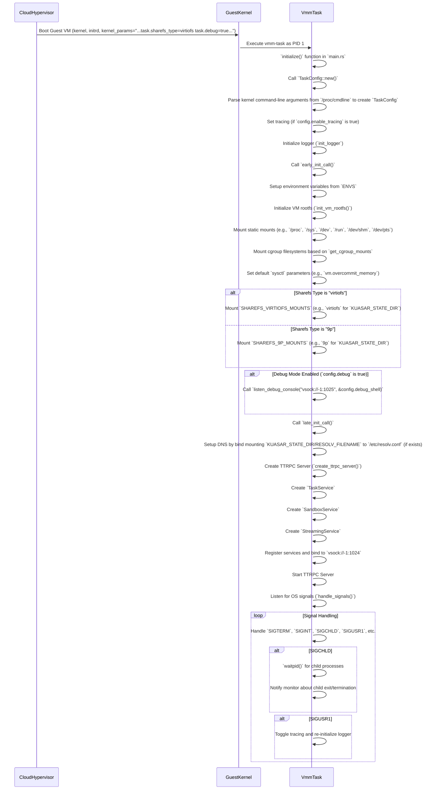

## vmm task 启动

问：cloud hypervisor 的 microvm 里面的 kuasar agent，是通过什么方式启动的？systemd，还是 init 脚本？

在 Cloud Hypervisor MicroVM 内部，Kuasar agent (即 [`vmm-task`](https://github.com/kuasar-io/kuasar/blob/a5dc8e2c564405a8c389aaaf3eb708a123059ce1/Makefile#L23)) 是作为 PID 1 进程启动的，它会处理操作系统的初始化和信号，而不是通过传统的 [`systemd`](https://github.com/kuasar-io/kuasar/blob/a5dc8e2c564405a8c389aaaf3eb708a123059ce1/docs/vmm/README.md?plain=1#L65) 或 [`init`](https://github.com/kuasar-io/kuasar/blob/a5dc8e2c564405a8c389aaaf3eb708a123059ce1/vmm/sandbox/src/kata_config.rs#L183) 脚本启动。

以下是 [`vmm-task`](https://github.com/kuasar-io/kuasar/blob/a5dc8e2c564405a8c389aaaf3eb708a123059ce1/Makefile#L23) 启动方式的详细说明：

1. **作为 PID 1 启动**：根据 [MicroVM Sandbox ([`VMM`](https://github.com/kuasar-io/kuasar/blob/a5dc8e2c564405a8c389aaaf3eb708a123059ce1/scripts/install/README.md?plain=1#L132))](#microvm-sandbox-vmm) 和 [VMM Task Lifecycle and Runtime Management](https://codewiki.google/github.com/kuasar-io/kuasar#microvm-sandbox-vmm-vmm-task-lifecycle-and-runtime-management) 描述，[`vmm-task`](https://github.com/kuasar-io/kuasar/blob/a5dc8e2c564405a8c389aaaf3eb708a123059ce1/Makefile#L23) 在 Guest VM 内部作为 PID 1 进程运行。这意味着它是 Guest OS 启动后执行的第一个用户空间进程，负责管理容器和进程的生命周期，以及处理资源分配、网络配置和异步 I/O 操作。
2. **初始化 VM 环境**：[`vmm-task`](https://github.com/kuasar-io/kuasar/blob/a5dc8e2c564405a8c389aaaf3eb708a123059ce1/Makefile#L23) 的主要入口点在 `kuasar-io/kuasar/vmm/task/src/main.rs`。这个组件会初始化 VM 的环境，设置必要的文件系统和内核参数。它还配置了一个 [`ttrpc`](https://github.com/kuasar-io/kuasar/blob/a5dc8e2c564405a8c389aaaf3eb708a123059ce1/Cargo.toml#L24) 服务器，用于暴露服务以管理任务、沙箱和流，允许外部组件与 VM 的内部进程进行交互。
3. **处理操作系统信号**：作为 PID 1 进程，[`vmm-task`](https://github.com/kuasar-io/kuasar/blob/a5dc8e2c564405a8c389aaaf3eb708a123059ce1/Makefile#L23) 还负责处理操作系统信号，包括回收子进程和管理优雅关机，这在 `kuasar-io/kuasar/vmm/task/src/main.rs` 的 [`handle_signals`](https://github.com/kuasar-io/kuasar/blob/a5dc8e2c564405a8c389aaaf3eb708a123059ce1/runc/src/main.rs#L274) 函数中有体现。
4. **配置通过内核命令行参数**：[`vmm-task`](https://github.com/kuasar-io/kuasar/blob/a5dc8e2c564405a8c389aaaf3eb708a123059ce1/Makefile#L23) 的配置参数由 [`TaskConfig`](https://github.com/kuasar-io/kuasar/blob/a5dc8e2c564405a8c389aaaf3eb708a123059ce1/vmm/task/src/config.rs#L43) 结构管理，该结构在 `kuasar-io/kuasar/vmm/task/src/config.rs` 中定义。这些配置是通过解析来自 [`/proc/cmdline`](https://github.com/kuasar-io/kuasar/blob/a5dc8e2c564405a8c389aaaf3eb708a123059ce1/vmm/task/src/config.rs#L66) 的内核命令行参数动态确定的，允许在运行时灵活调整，而无需依赖外部配置文件。例如，通过 [`kernel_params = "task.debug"`](https://github.com/kuasar-io/kuasar/blob/a5dc8e2c564405a8c389aaaf3eb708a123059ce1/docs/vmm/README.md?plain=1#L27) 可以在 [`vmm-task`](https://github.com/kuasar-io/kuasar/blob/a5dc8e2c564405a8c389aaaf3eb708a123059ce1/Makefile#L23) 中启用调试控制台功能。如 [`docs/vmm/README.md`](https://github.com/kuasar-io/kuasar/blob/a5dc8e2c564405a8c389aaaf3eb708a123059ce1/docs/vmm/README.md) 中“Developer Guide”部分的“Set up a debug console”所述，[`task.debug`](https://github.com/kuasar-io/kuasar/blob/a5dc8e2c564405a8c389aaaf3eb708a123059ce1/docs/vmm/README.md?plain=1#L122) 会作为 [`kernel_params`](https://github.com/kuasar-io/kuasar/blob/a5dc8e2c564405a8c389aaaf3eb708a123059ce1/vmm/sandbox/src/vm.rs#L114) 传递。

因此，Kuasar agent ([`vmm-task`](https://github.com/kuasar-io/kuasar/blob/a5dc8e2c564405a8c389aaaf3eb708a123059ce1/Makefile#L23)) 不依赖 [`systemd`](https://github.com/kuasar-io/kuasar/blob/a5dc8e2c564405a8c389aaaf3eb708a123059ce1/docs/vmm/README.md?plain=1#L65) 或传统的 [`init`](https://github.com/kuasar-io/kuasar/blob/a5dc8e2c564405a8c389aaaf3eb708a123059ce1/vmm/sandbox/src/kata_config.rs#L183) 脚本在 Guest VM 中启动，而是直接作为 MicroVM 的 PID 1 进程运行，并根据内核命令行参数进行配置和初始化。

